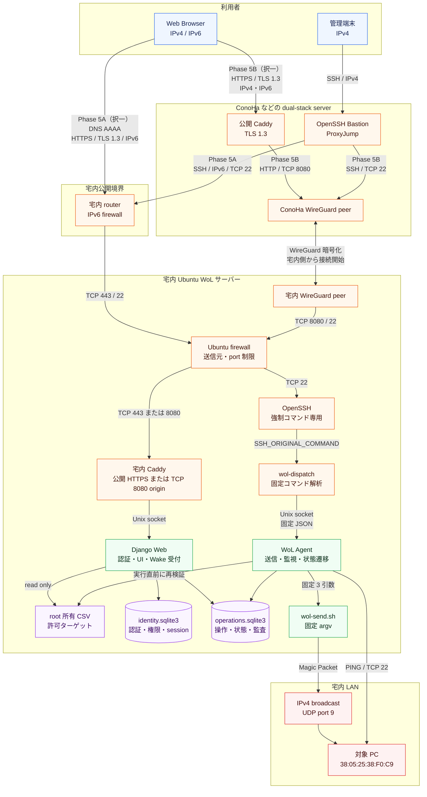

# WoL Web アプリ アーキテクチャ図

## 1. 統合構成

Phase 5A の宅内 IPv6 直接公開、Phase 5B の ConoHa HTTPS 入口、IPv4
ProxyJump 管理経路を 1 枚に統合する。
図中には代替経路を併記しているが、Phase 5A と Phase 5B は宅内 IPv6 の
着信可否に応じて配備時にいずれか一方を選択する。
図は利用者から対象 PC まで、上から下へ進む順序で配置する。



## 2. 経路の使い分け

| 構成・経路 | 公開 Web 入口 | 宅内 Ubuntu WoL サーバーまで | 用途 |
|---|---|---|---|
| Phase 5A | 宅内 Caddy の IPv6 TCP 443 | Web はIPv6で直接接続、管理CLIはConoHaからSSH IPv6 TCP 22 | 宅内 IPv6 着信が可能な場合 |
| Phase 5B | ConoHa Caddy の IPv4 / IPv6 TCP 443 | WebはWireGuard内TCP 8080、管理CLIはTCP 22 | 宅内 IPv6 着信が使えない場合 |
| ProxyJump CLI | ConoHa OpenSSH の IPv4 TCP 22 | Phase 5A は IPv6、Phase 5B は WireGuard | 制限済み管理 CLI |

## 3. 信頼境界

1. 公開 HTTPS 入口では TLS 1.3 だけを許可し、ProxyJump は SSH の暗号化で保護する。
2. Web から MAC、ブロードキャスト、UDP port、Shell command を受け取らない。
3. CSV は root 所有の許可リストとし、Web と Agent は読取専用とする。
4. Web は Wake 操作を `operations.sqlite3` に登録し、Shell Script を実行しない。
5. Agent は実行直前に CSV と `target_revision` を再検証する。
6. ProxyJump では任意 Shell を提供せず、UUID 付き固定 Wake command だけを許可する。
7. Magic Packet は ConoHa ではなく宅内 Ubuntu WoL サーバーから送信する。

## 4. Wake 操作の主な状態遷移

```text
Web / SSH request
  -> authenticated principal + target_id + idempotency key
  -> operations.sqlite3: ACCEPTED
  -> WoL Agent: CSV and revision revalidation
     -> expired before claim: EXPIRED / NOT_APPLICABLE
     -> invalid target or revision: REJECTED / NOT_APPLICABLE
     -> process not started: FAILED / NOT_APPLICABLE
     -> result uncertain after process start: OUTCOME_UNKNOWN / NOT_APPLICABLE
     -> /usr/local/libexec/wol-send.sh
        -> /usr/bin/wakeonlan -i BROADCAST -p 9 MAC
        -> PACKET_SENT
        -> PING / TCP 22 verification
        -> REACHABLE, NO_RESPONSE, or INTERRUPTED
```

`PACKET_SENT` は Magic Packet の送信処理が成功したことを示し、対象 PC の
起動完了を示さない。起動状態は後続の PING または TCP 22 で確認する。

詳細は [アーキテクチャ設計](01_ARCHITECTURE.md)、
[API とデータ設計](02_API_AND_DATA.md)、
[セキュリティ設計](03_SECURITY.md)を参照する。
