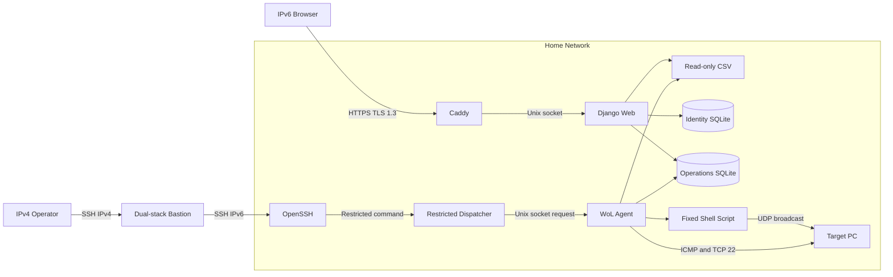
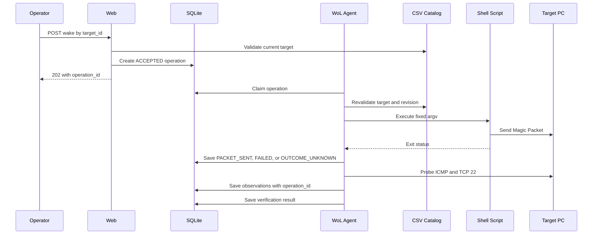
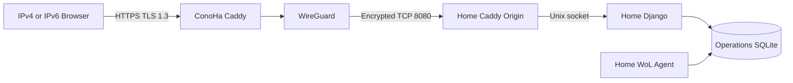

# アーキテクチャ設計

## 1. 文書の位置付け

- 状態: 初期設計
- 対象: Ubuntu 上の Web アプリ、宅内 WoL 実行、状態表示、IPv6 公開、
  IPv4 ProxyJump 経路
- 非対象: 実装コード、実環境の IP アドレス、ドメイン名、認証情報

本設計では、公開 Web 通信と宅内ネットワーク上の
[Wake on LAN](99_GLOSSARY.md#wol) 実行を分離する。Magic Packet は対象 PC と
同じブロードキャストドメインにある宅内 Ubuntu WoL サーバーから送信する。

## 2. 要求

### 2.1 機能要求

1. 登録済みホストの一覧と状態を Web 画面に表示する。
2. Web 画面から許可済みホストの起動を要求できる。
3. ホスト定義は [CSV](99_GLOSSARY.md#csv) ファイルから読み込む。
4. 次の状態をホスト単位で表示する。
   - 推定電源状態
   - PING 結果と最終確認時刻
   - SSH ポート結果と最終確認時刻
5. 宅内 Ubuntu WoL サーバーで固定 Shell Script を実行する。
6. IPv6 で Web アプリへ接続できる。
7. IPv4 専用の管理端末から ConoHa などの踏み台を経由できる。

### 2.2 非機能要求

1. ブラウザーから公開入口までを [TLS](99_GLOSSARY.md#tls) 1.3 のみに限定する。
2. 匿名の Wake 操作を許可しない。
3. Web リクエストから任意の MAC アドレスや Shell コマンドを渡せない。
4. Wake 操作と状態確認を監査できる。
5. 設定不備、ネットワーク障害、対象 PC の未応答を区別して表示する。
6. 低負荷な単一 Ubuntu サーバーで運用を開始できる。

## 3. ノード定義

| ノード | 責務 |
|---|---|
| オペレーター端末 | Web UI または SSH クライアントを操作する |
| ConoHa 入口 / 踏み台 | Phase 5A では SSH を中継し、Phase 5B では dual-stack HTTPS と SSH を提供する |
| 宅内 Ubuntu WoL サーバー | HTTPS、認証、CSV 読込、状態管理、Magic Packet 送信を担当する |
| 対象 PC | Magic Packet を受信し、PING または SSH ポートで応答する |

本リポジトリ内で「宅内」と記す場合は、対象 PC と同じ管理下のネットワークを
指す。「オペレーター端末側」と「宅内 Ubuntu WoL サーバー側」を明記し、
起点が不明な local / remote という表現は使わない。

## 4. 全体構成

直接 IPv6 と ConoHa 経由を統合した図は
[アーキテクチャ図](00_ARCHITECTURE_DIAGRAM.md)を参照する。



> - 図は Phase 5A の構成であり、この場合の ConoHa 踏み台は SSH の中継だけを担当する。
> - `wakeonlan` は宅内 Ubuntu WoL サーバー側の固定 Shell Script が実行する。
> - Web プロセスは Wake 操作を登録し、WoL Agent が実行直前に許可状態を再検証する。

## 5. コンポーネント

### 5.1 Caddy

- Phase 5A では Caddy は宅内 OS 上で HTTPS を待ち受け、宅内ルーターと Ubuntu
  ファイアウォールが公開範囲を IPv6 TCP 443 に限定する。
- Phase 5B では ConoHa Caddy が公開 HTTPS を受け、宅内 Caddy は WireGuard
  interface の固定 TCP 8080 だけで origin を提供する。
- 公開証明書を取得、更新する。
- TLS 1.3 のみを許可する。
- HTTP/3 の 0-RTT を無効にする。
- Django Web へ Unix ソケットで中継する。
- アクセスログとセキュリティヘッダーを提供する。

### 5.2 Django Web

- サーバー描画の Web UI を提供する。
- 利用者認証、権限、セッション、CSRF 防御を担当する。
- CSV カタログと SQLite 状態を結合して表示する。
- Wake 操作を `ACCEPTED` 状態で SQLite に登録する。
- Web 入力として `target_id` 以外の送信先情報を受け付けない。

Django 5.2 LTS を第一候補とする。認証、権限、セッション、CSRF 防御を標準機能で
構成でき、状態変更を伴う小規模な管理画面に適するためである。

### 5.3 WoL Agent

- `ACCEPTED` 状態の Wake 操作を取得する。
- 実行直前に最新 CSV を読み、対象の存在、MAC、許可状態、カタログ版を再検証する。
- 固定 Shell Script を引数配列形式で実行する。
- 実行結果を `PACKET_SENT`、`FAILED`、`OUTCOME_UNKNOWN` のいずれかで保存する。
- 通常監視と Wake 後の追加監視を行う。
- PING と TCP 22 の結果を個別に保存する。
- 5 秒ごとに heartbeat と readiness を SQLite へ保存する。
- 実行前に停止した操作と実行中に停止した操作を別の状態へ回復する。

初期実装では Django と同じ Python パッケージを利用するが、systemd 上では
Web プロセスと別サービスにする。Web プロセスに直接 Shell を実行させないことで、
責務と監査点を明確にする。

### 5.4 CSV カタログ

- 許可済みホストの正本とする。
- 宅内 Ubuntu WoL サーバー側の管理者が配置する。
- Web と WoL Agent からは読取専用にする。
- Web からのアップロードや編集は初期対象に含めない。
- 読込に失敗した場合は直前の正常スナップショットを維持する。

### 5.5 SQLite

認証系と操作系を別 DB にする。

- `identity.sqlite3`: Django の利用者、権限、セッション。`wol-web` だけがアクセスする。
- `operations.sqlite3`: 状態、Wake 操作、監査、Agent heartbeat。Web と Agent が
  共有する。

- PING、SSH、推定電源状態を保存する。
- Wake 操作と監査履歴を保存する。
- CSV の静的な許可リストとは分離する。
- 単一サーバー、低頻度操作を初期前提とする。
- Write-Ahead Logging と busy timeout を設定し、書込トランザクションを短く保つ。
- WoL Agent の実行インスタンスは 1 個に限定する。
- Network File System 上には配置しない。
- 共有 DB の本体、`-wal`、`-shm` に同じグループ権限を適用する。

複数の WoL サーバーから同じ状態を更新する段階になった場合は PostgreSQL などを
再評価する。

### 5.6 固定 Shell Script

想定配置先は `/usr/local/libexec/wol-send.sh` とする。

- root 所有、アプリ用ユーザーから書込不可にする。
- 引数個数と形式を再検証する。
- `/usr/bin/wakeonlan` を絶対パスで実行する。
- 任意コマンド、任意ファイル、追加オプションを受け付けない。
- 通常は sudo を利用しない。

契約は次の形式を候補とする。

```text
wol-send.sh MAC_ADDR BROADCAST_ADDR WOL_PORT
```

初期の疎通確認では次の実行と同等にする。

```bash
/usr/bin/wakeonlan 38:05:25:38:F0:C9
```

固定 3 引数を使う本番 Script は、検証後に次を実行する。

```bash
exec /usr/bin/wakeonlan \
  -i "$broadcast_addr" \
  -p "$wol_port" \
  "$mac_addr"
```

### 5.7 SSH Dispatcher

- ProxyJump 経由の強制コマンド入口とする。
- `SSH_ORIGINAL_COMMAND` は `wake TARGET_ID IDEMPOTENCY_KEY` または
  `status OPERATION_ID` の固定形式だけを許可する。
- `/run/wol-agent/dispatch.sock` へ固定形式の受付要求を送る。
- Wake の UUID idempotency key を検証して Agent へ渡す。
- CSV と SQLite を直接読み書きしない。
- Agent が Web API と同じ操作受付サービスを呼び、SQLite に `ACCEPTED` 操作を
  登録する。
- Agent が最新 CSV、heartbeat、利用者上限、クールダウンを Web API と同じ規則で
  検証する。
- `operation_id` を標準出力へ返す。
- `wol-send.sh` や `wakeonlan` を直接実行しない。
- 任意 Shell、任意 MAC、任意オプションを受け付けない。

## 6. Wake 操作フロー



`wakeonlan` の終了コード 0 は Magic Packet の送信要求が受理されたことだけを
表す。対象 PC の起動完了とは扱わず、後続の PING または TCP 22 応答で確認する。

## 7. IPv6 Web 経路

初期の公開経路は次のとおりとする。

```text
IPv6 browser
  -> DNS AAAA
  -> Home router IPv6 firewall
  -> Home Ubuntu Caddy TCP/443
  -> Django Unix socket
```

TLS 1.3 の保護範囲は IPv6 ブラウザーから Caddy までである。同じ宅内 Ubuntu
WoL サーバー内の Caddy と Django 間は Unix ソケットの OS 権限で保護する。
宅内 LAN へ送る Magic Packet、PING、TCP 22 の状態確認は Web TLS の対象ではない。
ProxyJump 経路は TLS ではなく SSH の暗号化で保護する。

成立条件:

- 宅内 Ubuntu WoL サーバーにインターネット到達可能な IPv6 アドレスがある。
- ドメインの AAAA レコードがその IPv6 アドレスを指す。
- ISP と宅内ルーターが着信 IPv6 を許容する。
- 宅内ルーターは TCP 443 を Caddy に許可する。
- IPv6 プレフィックスが変わる場合は AAAA を自動更新する。
- 証明書の名前とアクセス時のドメイン名が一致する。

リンクローカル IPv6 や Unique Local Address だけでは、インターネット上の
ブラウザーから直接接続できない。

### 7.1 宅内 IPv6 着信が使えない場合

宅内 Ubuntu WoL サーバーが着信 IPv6 を受けられない場合は、ConoHa を
dual-stack の HTTPS 入口とし、宅内との間に外向き開始の WireGuard 経路を作る。



この構成では TLS 1.3 を ConoHa Caddy で終端し、ConoHa から宅内 Caddy origin
までを WireGuard で暗号化する。宅内 Caddy の origin は初期既定の TCP 8080 で
待ち受け、WireGuard 上の ConoHa peer だけに許可する。このポートは配備設定として
固定し、Web リクエストや CSV から変更できない。Django は引き続き Unix ソケット
だけで待ち受ける。
CSV、操作 DB、認証 DB、Magic Packet 送信は宅内 Ubuntu WoL サーバー側に残す。
ConoHa には TLS と WireGuard に必要な資格情報以外を配置しない。

A と AAAA は ConoHa を指す。宅内 Caddy は ConoHa の WireGuard アドレスだけを
信頼済み proxy とし、それ以外からの転送ヘッダーを信頼しない。ConoHa Caddy の
Proxy 障害は、origin 接続前でも操作登録後の応答消失でも 502 になり得るため、
ブラウザーは HTTP status だけで受付有無を判定しない。UI は受付結果確認中と表示し、
同じ `Idempotency-Key` で再送する。初回が未受付なら一つの操作を新規登録し、
登録済みなら同じ `operation_id` を回収する。

## 8. IPv4 ProxyJump 経路

ProxyJump は Web プロキシではなく SSH クライアントの接続方式である。初期用途は
IPv4 専用のオペレーター端末から宅内 Ubuntu WoL サーバーへ管理接続し、制限済み
コマンドを実行することとする。

```text
IPv4 operator
  -> ConoHa bastion IPv4 TCP/22
  -> Home Ubuntu WoL server TCP/22
  -> Restricted WoL command
```

成立条件:

- オペレーター端末から ConoHa の IPv4 TCP 22 に到達できる。
- Phase 5A では、ConoHa 踏み台から宅内 Ubuntu WoL サーバーの公開 IPv6 TCP 22
  に到達できる。
- Phase 5B では、ConoHa 踏み台から宅内 Ubuntu WoL サーバーの WireGuard peer
  TCP 22 に到達できる。
- 宅内ファイアウォールが選択経路の ConoHa 送信元だけを許可する。
- 踏み台の SSH 転送先を宅内 Ubuntu WoL サーバーの TCP 22 だけに限定する。
- 踏み台と最終接続先のホスト鍵をそれぞれ検証する。
- SSH agent forwarding を使わない。

オペレーター端末側の共通踏み台設定:

```sshconfig
Host wol-bastion
    HostName 192.0.2.10
    AddressFamily inet
    User wol-jump
    IdentityFile /path/to/bastion_key
    IdentitiesOnly yes
    BatchMode yes
    StrictHostKeyChecking yes
    UserKnownHostsFile /path/to/known_hosts_wol
```

Phase 5A の最終接続先:

```sshconfig
Host wol-home
    HostName 2001:db8::10
    AddressFamily inet6
    User wol-operator
    ProxyJump wol-bastion
    IdentityFile /path/to/home_key
    IdentitiesOnly yes
    BatchMode yes
    StrictHostKeyChecking yes
    UserKnownHostsFile /path/to/known_hosts_wol
    ForwardAgent no
```

Phase 5B の最終接続先:

```sshconfig
Host wol-home
    HostName 10.90.0.2
    AddressFamily inet
    User wol-operator
    ProxyJump wol-bastion
    IdentityFile /path/to/home_key
    IdentitiesOnly yes
    BatchMode yes
    StrictHostKeyChecking yes
    UserKnownHostsFile /path/to/known_hosts_wol
    ForwardAgent no
```

接続と実行の形:

```bash
ssh wol-home -- wake ms-02ultra 5b191f84-d6f5-4ff6-92e7-3cb5d575549c
ssh wol-home -- status cb0b8ec5-64ea-45e1-a942-f4a4bc79222e
```

`wol-operator` の公開鍵に強制コマンドを設定し、任意 Shell を提供しない。
Dispatcher は Web API と同じキューを使うため、監査、再検証、クールダウン、
状態更新を迂回しない。SSH 応答を失った場合は同じ idempotency key で Wake
コマンドを再実行し、同じ `operation_id` を回収する。

### 8.1 ProxyJump 単独では到達できない場合

宅内 Ubuntu WoL サーバーが着信 IPv6 を受けられない場合、ProxyJump だけでは
成立しない。初期設計では Phase 5B の WireGuard 経路を採用し、ConoHa と宅内
Ubuntu WoL サーバーの peer 間 TCP 22 を ProxyJump の第 2 区間にする。
SSH リバーストンネルは初期対象に含めない。

## 9. Magic Packet のネットワーク制約

- MAC アドレスは [L2](99_GLOSSARY.md#l2) の識別子であり、インターネット上の
  ルーターは対象 MAC まで経路制御しない。
- `255.255.255.255` の限定ブロードキャストはルーターを越えない。
- IPv6 にはブロードキャストアドレスがない。
- SSH のポート転送は TCP 用であり、UDP ブロードキャスト自体を転送しない。
- 各 VLAN に起動対象がある場合は、VLAN ごとに WoL Agent を置くか、管理された
  WoL リレーを用意する。
- インターネットから IPv4 directed broadcast を許可する構成は採用しない。
- 対象 PC の UEFI / BIOS と NIC で Magic Packet 受信を有効にする。
- 対象 PC の停止中も NIC に待機電力が供給されることを確認する。
- Linux 対象では `ethtool` の `Wake-on: g` を確認する。
- `BROADCAST_ADDR` が対象サブネットの実際のブロードキャストであることを確認する。
- 複数 NIC の宅内 Ubuntu WoL サーバーでは、OS の送信経路が期待する
  インターフェースを選ぶことを `ip route get` と Packet capture で確認する。
- Magic Packet 自体に認証はない。TLS、Django 認証、SSH 制限は送信要求の入口を
  保護するものである。

## 10. 障害時の表示

| 障害 | Web 上の扱い |
|---|---|
| CSV が不正 | 直前の正常カタログを表示し、設定エラーと鮮度を表示 |
| Wake 受付時に Agent が stale | `503 Agent Unavailable` とし、操作を登録しない |
| 受付後、Agent 取得前に期限超過 | `EXPIRED` とし、Packet を送らない |
| Shell process を開始できない | `FAILED` と失敗理由を記録 |
| Shell process 開始後に timeout、signal、非 0 終了 | `OUTCOME_UNKNOWN` とし、自動再実行しない |
| Agent が Shell Script 実行中に停止 | `OUTCOME_UNKNOWN` とし、自動再実行しない |
| Agent が Wake 後確認中に停止 | 60 秒以内は残りの確認を再開し、超過時は `INTERRUPTED` |
| Packet 送信後も応答なし | `PACKET_SENT`、`NO_RESPONSE`、`UNKNOWN` を併記 |
| Proxy が Wake POST で 502 を返す | 受付結果確認中とし、同じ Idempotency-Key で操作 ID を回収 |
| PING 失敗、SSH 成功 | 起動中と推定し、両結果を個別表示 |
| IPv6 または TLS 異常 | HTTPS を成立させず、Wake 操作を受け付けない |
| ProxyJump の第 2 区間が不通 | 管理経路異常として WoL 実行結果と分離 |

## 11. 技術選定

| 領域 | 初期選定 | 理由 |
|---|---|---|
| TLS 終端 | Caddy | TLS 1.3 限定と証明書自動更新を少ない設定で実現できる |
| Web | Django 5.2 LTS | 認証、権限、セッション、CSRF 防御を標準利用できる |
| UI | Django Template + 小規模 JavaScript | SPA を導入せず、攻撃面と構成要素を抑える |
| 状態保存 | SQLite | 単一 Ubuntu サーバーの低頻度操作に十分 |
| ホスト定義 | 読取専用 CSV | ユーザー要求との互換性を保つ |
| サービス管理 | systemd | Web、Agent、ログ、資格情報を OS 標準機能で管理できる |
| 管理経路 | OpenSSH ProxyJump | IPv4 踏み台から IPv6 最終接続先へ中継できる |

## 12. 設計判断

### ADR-001: CSV と変動状態を分離する

CSV は許可済みホストの正本、SQLite は変動状態と履歴とする。Web プロセスが
許可 MAC を含む CSV を更新する必要をなくし、競合と改変リスクを減らす。

### ADR-002: Web API は MAC を受け取らない

Wake API は `target_id` だけを受け取る。MAC、ブロードキャスト先、ポートは
サーバー側 CSV から解決し、WoL Agent が実行直前にも再検証する。

### ADR-003: Packet 送信成功と電源 ON を分離する

Magic Packet には起動完了応答がない。Shell Script の成功は `PACKET_SENT`、
状態プローブの成功は `ON` として別々に管理する。

### ADR-004: 公開経路は宅内 IPv6 到達性で選択する

宅内 IPv6 着信が成立する場合は Phase 5A とし、IPv6 ブラウザーは宅内 Caddy へ
直接接続する。成立しない場合は Phase 5B とし、ブラウザーは ConoHa Caddy へ
TLS 1.3 で接続し、宅内 origin までを WireGuard で暗号化する。どちらの場合も
IPv4 専用の管理端末は ConoHa を ProxyJump として利用する。

## 13. 実装前に確定が必要な値

- 公開ドメイン名
- 宅内 Ubuntu release と `wakeonlan` package 版
- 宅内 Ubuntu WoL サーバーの IPv6 到達可否
- IPv6 プレフィックスが固定か変動か
- 対象 PC の IPv4 アドレスまたは名前解決方式
- 対象サブネットのブロードキャストアドレス
- PING 不許可ホストの状態判定方法
- Phase 5A では ConoHa 踏み台から宅内 IPv6 TCP 22 への到達可否
- Phase 5B では ConoHa 踏み台から宅内 WireGuard peer TCP 22 への到達可否
- 利用者数と認証方式

## 14. 参考資料

- [Caddy TLS 設定](https://caddyserver.com/docs/caddyfile/directives/tls)
- [Caddy Automatic HTTPS](https://caddyserver.com/docs/automatic-https)
- [Ubuntu wakeonlan manual](https://manpages.ubuntu.com/manpages/jammy/man1/wakeonlan.1.html)
- [OpenSSH ProxyJump](https://man.openbsd.org/ssh_config#ProxyJump)
- [OpenSSH sshd_config](https://man.openbsd.org/sshd_config)
- [Let's Encrypt IPv6 Support](https://letsencrypt.org/docs/ipv6-support/)
- [ConoHa VPS IPv6 設定](https://doc.conoha.jp/products/vps-v2/network-v2/ipv6-v2/)
- [SQLite Write-Ahead Logging](https://www.sqlite.org/wal.html)
- [SQLite transactions](https://sqlite.org/lang_transaction.html)
- [WireGuard Quick Start](https://www.wireguard.com/quickstart/)
- [IPv4 directed broadcast の既定禁止](https://www.rfc-editor.org/rfc/rfc2644.html)
- [IPv6 Addressing Architecture](https://www.rfc-editor.org/rfc/rfc4291.html)
