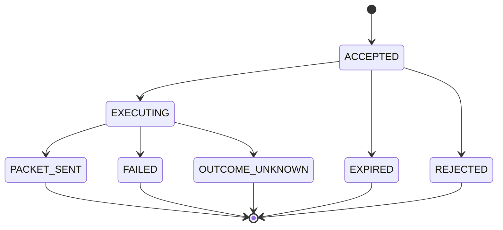
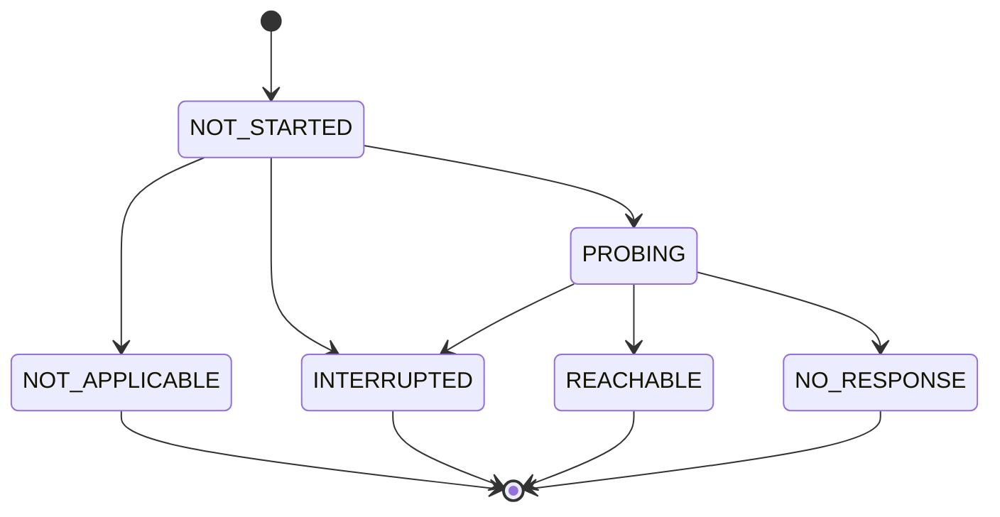

# API とデータ設計

## 1. 方針

本設計は、ユーザー指定の 7 列 [CSV](99_GLOSSARY.md#csv) を読み込める互換性を
維持しながら、許可リストと変動状態を分離する。

- `config/targets.csv`: リポジトリ開発時の許可済みターゲット例
- `var/identity.sqlite3`: 開発時の Django 利用者、権限、セッション
- `var/operations.sqlite3`: 開発時の状態、Wake 操作、監査、Agent heartbeat
- `var/targets_status.csv`: 開発時に必要な場合だけ生成する状態スナップショット

宅内 Ubuntu WoL サーバーの本番配置では、入力を
`/etc/wol-web/targets.csv`、認証 DB を
`/var/lib/wol-web/identity.sqlite3`、共有状態 DB を
`/var/lib/wol-operations/operations.sqlite3`、
任意の状態出力を `/var/lib/wol-web/targets_status.csv` とする。

Web 画面は CSV と SQLite を `target_id` で結合した結果を表示する。CSV を
Web プロセスが上書きしないため、状態更新と管理者編集の競合を避けられる。

## 2. 指定 CSV との互換

### 2.1 必須列

```csv
HOST_NAME,MAC_ADDR,POWER_STATUS,PING,LAST_PING_TIME,SSH,LAST_SSH_TIME
"MS-02ULTRA","38:05:25:38:F0:C9","UNKNOWN","UNKNOWN","","UNKNOWN",""
```

ユーザー提示例の `”on”` に使われている `”` はスマートクォート U+201D であり、
CSV の引用符 U+0022 `"` ではない。値の一部として誤読されるため、行番号と列名を
含む検証エラーにする。

`00:00` には日付、タイムゾーン、未確認との区別がない。時刻は
[RFC 3339](99_GLOSSARY.md#rfc3339) の UTC 形式にし、未確認は空欄にする。

```csv
HOST_NAME,MAC_ADDR,POWER_STATUS,PING,LAST_PING_TIME,SSH,LAST_SSH_TIME
"MS-02ULTRA","38:05:25:38:F0:C9","ON","OK","2026-07-30T00:00:00Z","OK","2026-07-30T00:00:00Z"
```

### 2.2 値の意味

| 列 | 型または値 | 意味 |
|---|---|---|
| `HOST_NAME` | 1～63 文字 | 表示名。初期互換では `target_id` の生成元にも使う |
| `MAC_ADDR` | 大文字コロン形式 | Magic Packet の対象 MAC |
| `POWER_STATUS` | `ON` / `OFF` / `UNKNOWN` | 推定電源状態 |
| `PING` | `OK` / `FAIL` / `UNKNOWN` | 最新の PING 結果 |
| `LAST_PING_TIME` | RFC 3339 UTC または空 | 最後に PING を試行した時刻 |
| `SSH` | `OK` / `FAIL` / `UNKNOWN` | 最新の TCP 22 接続結果 |
| `LAST_SSH_TIME` | RFC 3339 UTC または空 | 最後に TCP 22 接続を試行した時刻 |

PING または TCP 22 の新しい `OK` があれば `POWER_STATUS=ON` と推定する。
両方が失敗しても、ファイアウォールやネットワーク障害の可能性があるため、初期実装
では原則 `UNKNOWN` とする。`OFF` は IPMI や電源管理 API など、明示的な確認手段を
追加した場合に利用する。

CSV 初期値でも `POWER_STATUS` は派生値として再計算し、入力値をそのまま表示しない。
`PING` または `SSH` が `OK` なら `ON`、それ以外は `UNKNOWN` とする。`OK` または
`FAIL` には対応する確認時刻を必須とし、`UNKNOWN` の確認時刻は空欄にする。入力
`POWER_STATUS` と派生値が異なる場合はカタログ警告を表示する。

### 2.3 状態確認に必要な追加列

指定 7 列だけでは PING と TCP 22 の宛先、ブロードキャスト先、WoL 許可状態を
一意に決められない。初期互換では `HOST_NAME` を名前解決するが、実運用用には
次の列を追加する。

```csv
TARGET_ID,HOST_NAME,MAC_ADDR,WOL_ENABLED,PROBE_ADDR,BROADCAST_ADDR,WOL_PORT,POWER_STATUS,PING,LAST_PING_TIME,SSH,LAST_SSH_TIME
"ms-02ultra","MS-02ULTRA","38:05:25:38:F0:C9","true","192.0.2.10","192.0.2.255","9","UNKNOWN","UNKNOWN","","UNKNOWN",""
```

| 追加列 | 意味 |
|---|---|
| `TARGET_ID` | URL と履歴に使う変更しない識別子 |
| `WOL_ENABLED` | Wake 操作を許可するか |
| `PROBE_ADDR` | 宅内 Ubuntu WoL サーバーから確認する IPv4 またはホスト名 |
| `BROADCAST_ADDR` | 対象サブネットの IPv4 ブロードキャスト |
| `WOL_PORT` | UDP 宛先ポート。初期実装は 9 だけを許可 |

`192.0.2.0/24` は文書用アドレスであり、実環境値に置き換える。

指定 7 列だけを読み込む互換モードでは、次の決定規則を使う。

| 不足項目 | 互換モードの値 |
|---|---|
| `TARGET_ID` | `HOST_NAME` を小文字化し、英数字、`.`、`_`、`-` 以外を `-` にした値 |
| `WOL_ENABLED` | `true`。root 所有 CSV に行があることを許可指定として扱う |
| `PROBE_ADDR` | `HOST_NAME`。名前解決できない場合はプローブを `UNKNOWN` にする |
| `BROADCAST_ADDR` | `255.255.255.255`。`wakeonlan MAC_ADDR` と同じ既定動作 |
| `WOL_PORT` | `9` |

生成値と拡張 CSV の明示値には、全入口で共通して
`^[a-z0-9][a-z0-9._-]{0,62}$` を要求し、`.` と `..` は拒否する。生成した値が空、
重複、または規則外になる場合は CSV 全体を不正とする。互換モードは WoL サーバーと
対象 PC が同じブロードキャストドメインにある最小構成向けである。複数サブネット、
複数 VLAN、確実な状態確認が必要な場合は拡張列を必須にする。

### 2.4 CSV 状態値と SQLite の優先順位

- 新規ターゲットに SQLite 観測がない間は、CSV の状態列を初期表示に利用できる。
- WoL Agent が最初の状態確認を保存した後は、現在の `target_revision` と一致する
  SQLite の値を優先する。
- CSV の状態値には `source=csv`、実測値には `source=probe` を内部的に付ける。
- CSV の状態列が変更されても、より新しい SQLite 観測を過去の値で上書きしない。
- Web と WoL Agent は入力 CSV を更新しない。
- 結合後の最新状態が必要な場合だけ、別の `targets_status.csv` を生成する。

## 3. CSV 読込規則

1. UTF-8 とする。先頭 BOM は読込時だけ許容し、出力には付けない。
2. Python 標準 `csv.DictReader` を使う。
3. Shell の文字列分解、`awk`、単純な `split(",")` で解析しない。
4. ヘッダー名、必須列、列数、最大ファイルサイズ、最大行数を検証する。
5. `HOST_NAME`、`TARGET_ID`、正規化済み MAC の重複を全体エラーとする。
6. MAC は `38:05:25:38:F0:C9` の大文字コロン形式に正規化する。
7. 全ゼロ、全 `FF`、マルチキャスト MAC を拒否する。
8. 状態値は大文字に正規化する。
9. タイムゾーンなし日時、時刻だけの値、不正な日時を拒否する。
10. 初期実装では `WOL_PORT` が 9 以外の行を拒否する。
11. エラーにはファイル名、行番号、列名、理由を含める。
12. 読込失敗時は不正ファイルで直前の正常カタログを上書きしない。
13. 正常な CSV ファイル全体の SHA-256 を診断用 `source_digest` として保持する。
14. Wake に影響する正規化済み設定列だけから `catalog_revision` を生成する。
15. 管理者の更新も同一ディレクトリの一時ファイルへ完全に書き出し、`fsync()` 後に
    同一ファイルシステム上で原子的に置換する。

ファイル変更は一定間隔で確認し、完全な新スナップショットを構築してから一度に
参照先を変更する。読込途中の状態を Web リクエストへ見せない。

`catalog_revision` の対象は `TARGET_ID`、`MAC_ADDR`、`WOL_ENABLED`、
`PROBE_ADDR`、`BROADCAST_ADDR`、`WOL_PORT` とする。行を `TARGET_ID` 順に並べ、
正規化した値の SHA-256 を計算する。`POWER_STATUS`、PING / SSH 結果、確認時刻は
対象外とし、状態値だけの変更で待機操作を拒否しない。

各行についても同じ正規化済み実行列から `target_revision` を生成する。これにより、
別ターゲットの変更では現在の観測を維持し、同じ `target_id` の MAC、
`PROBE_ADDR`、送信設定、許可状態が変わった場合だけ旧観測を現在状態から除外する。

正常な `CatalogSnapshot` は SQLite にも保存する。CSV が不正な状態で再起動した
場合は、最後の正常スナップショットを閲覧専用かつ stale として表示するが、Wake
操作は受け付けず readiness を false にする。実行時の許可判定に不正 CSV や
永続キャッシュを使わない。

## 4. ドメインモデル

### 4.1 WakeTarget

| 属性 | 型 | 説明 |
|---|---|---|
| `target_id` | `str` | URL と履歴で使う識別子 |
| `host_name` | `str` | 表示名 |
| `mac_address` | `MacAddress` | 正規化済み MAC |
| `wol_enabled` | `bool` | Wake 許可 |
| `probe_address` | `str` | PING と TCP 22 の宛先 |
| `broadcast_address` | IPv4 | Magic Packet の送信先 |
| `wol_port` | `int` | 初期実装では固定値 9 |
| `target_revision` | SHA-256 | この対象の正規化済み実行設定版 |

### 4.2 ProbeObservation

| 属性 | 型 | 説明 |
|---|---|---|
| `observation_id` | UUID | 観測 ID |
| `target_id` | `str` | 対象 ID。検索用 index を設ける |
| `probe_kind` | `PING` / `SSH` | 観測種別 |
| `result` | `OK` / `FAIL` / `UNKNOWN` | 個別プローブ結果 |
| `source` | `CSV` / `PROBE` | CSV 初期値か実測か |
| `checked_at` | UTC datetime または `null` | 未観測は `null`、それ以外は試行時刻 |
| `latency_ms` | `int` または `null` | 応答時間 |
| `error_code` | `str` または `null` | 安定した機械可読エラー |
| `operation_id` | UUID または `null` | Wake 後確認では操作 ID、通常監視では `null` |
| `target_revision` | SHA-256 | 観測時に使用した対象設定版 |

### 4.3 TargetStatus

| 属性 | 型 | 説明 |
|---|---|---|
| `target_id` | `str` | CSV と結合する主キー |
| `target_revision` | SHA-256 | 現在状態を集計した対象設定版 |
| `power_status` | `ON` / `OFF` / `UNKNOWN` | 推定状態 |
| `ping` | `ProbeObservation` | PING 結果 |
| `ssh` | `ProbeObservation` | TCP 22 結果 |
| `updated_at` | UTC datetime または `null` | 未観測は `null`、それ以外は状態更新時刻 |
| `is_stale` | `bool` | 鮮度上限を超えたか |

`ProbeObservation.target_id` は `TargetStatus.target_id` へ関連付け、
`operation_id` は Wake 後確認時だけ `WakeOperation` へ関連付ける。CSV は DB
table ではないため外部キーにはせず、一覧は現在の CatalogSnapshot の `target_id`
集合を基準に結合する。削除済みターゲットの観測は監査保持期間中は履歴として残すが、
現在一覧には表示しない。

### 4.4 WakeOperation

| 属性 | 型 | 説明 |
|---|---|---|
| `operation_id` | [UUID](99_GLOSSARY.md#uuid) | 操作追跡 ID |
| `request_source` | `WEB` / `SSH` | 操作入口 |
| `idempotency_key` | UUID | Web header または SSH wake コマンドの要求値 |
| `target_id` | `str` | 対象 |
| `catalog_revision` | SHA-256 | 受付時の CSV 版 |
| `target_revision` | SHA-256 | 受付時の対象実行設定版 |
| `requested_by` | `str` | Web と SSH で共有する正規化済み主体 ID |
| `requested_at` | UTC datetime | 受付時刻 |
| `expires_at` | UTC datetime | Agent が取得できる期限 |
| `delivery_state` | enum | Packet 送信処理の状態 |
| `verification_state` | enum | Wake 後確認の状態 |
| `claimed_by` | `str` または `null` | 操作を取得した Agent ID |
| `claimed_at` | UTC datetime または `null` | 原子的に取得した時刻 |
| `attempt_no` | `int` | 初期値 1。初期設計では自動再実行しない |
| `packet_sent_at` | UTC datetime または `null` | Script が成功した時刻 |
| `completed_at` | UTC datetime または `null` | 配送と確認がともに終端した時刻 |
| `failure_code` | `str` または `null` | 配送または確認の失敗分類 |

`(requested_by, target_id, idempotency_key)` に DB の一意制約を設ける。
`request_source` は最初に操作を登録した入口を記録するが、冪等性の scope には
含めない。Web / SSH 操作行は最低 24 時間保持し、その間は入口をまたぐ並行再送でも
一つの `operation_id` だけが成立する。保持期間後も操作行を残す場合は一意性を
維持し、行を削除した後に限って同じ key を新規要求として扱える。

送信処理状態:



`REJECTED` は受付後に CSV が変更され、対象削除、MAC 変更、無効化が検出された
場合に使う。`EXPIRED` は Agent が期限内に取得できなかった場合に使う。
`FAILED` は Script process を開始する前の検証失敗、または process を開始できなかった
場合に使う。`OUTCOME_UNKNOWN` は Script process 開始後の timeout、signal、非 0 終了、
Agent 停止などにより Packet 送信の有無を確定できない場合に使う。Ubuntu
`wakeonlan` manual は送信後の失敗を区別する終了コード契約を示していないため、
非 0 を安全な未送信とは扱わない。この状態を自動再実行せず、監査記録と
クールダウンを確認して利用者が再操作する。

Wake 後確認状態:



`delivery_state=PACKET_SENT` と `verification_state=NO_RESPONSE` は同時に成立する。
通常監視と Wake 後確認を区別するため、後者の `ProbeObservation` に
`operation_id` を保存する。Packet 送信を確認できなかった配送終端では
`NOT_APPLICABLE` とする。

Agent 起動時は、`delivery_state=PACKET_SENT` かつ確認状態が `NOT_STARTED` または
`PROBING` の操作を回復対象にする。`packet_sent_at` から 60 秒以内なら即時に
追加確認を 1 回行い、その後に残っている予定時刻の確認を再開する。60 秒を超えて
確認機会を失っていた場合は `INTERRUPTED`、`failure_code=PROBE_WINDOW_MISSED`、
`completed_at=現在時刻` とする。通常監視は継続するが、後から得た通常監視結果で
過去操作の `INTERRUPTED` を上書きしない。

Wake 後確認の各回でも、操作の `target_revision` と現在値を比較する。不一致なら
旧操作へ新しい監視先の結果を関連付けず、`verification_state=INTERRUPTED`、
`failure_code=TARGET_CHANGED`、`completed_at=現在時刻` とする。新しい対象設定の
即時通常プローブは別の `operation_id=null` 観測として実行する。

### 4.5 AgentHeartbeat

| 属性 | 型 | 説明 |
|---|---|---|
| `agent_id` | `str` | 単一 Agent の識別子 |
| `updated_at` | UTC datetime | 最終 heartbeat |
| `version` | `str` | Agent の実装版 |
| `catalog_revision` | SHA-256 または `null` | Agent が正常に読めた CSV 版 |
| `ready` | `bool` | CSV、DB、実行環境が利用可能か |

Agent は 5 秒ごとに heartbeat を更新する。Web は 15 秒以内かつ `ready=true` を
準備済みと扱い、それ以外では Wake 受付を `503 AGENT_UNAVAILABLE` で拒否する。
受付操作の `expires_at` は 30 秒後とし、Agent の取得条件に
`expires_at > current_time` を含める。期限超過は実行せず `EXPIRED` とする。
Agent 再起動時と通常の保守処理で状態を永続化する。Agent が取得した後の停止は
Shell 実行結果を保存する前なら `OUTCOME_UNKNOWN` とする。`PACKET_SENT` 保存後の
停止は 4.4 節の確認回復規則に従う。

### 4.6 CatalogSnapshot

| 属性 | 型 | 説明 |
|---|---|---|
| `catalog_revision` | SHA-256 | 正規化済み実行設定の版 |
| `source_digest` | SHA-256 | 入力ファイル全体の診断用ハッシュ |
| `loaded_at` | UTC datetime | 正常読込時刻 |
| `targets_json` | JSON | 検証済みターゲットの閲覧用キャッシュ |

正常読込時だけ SQLite に追加する。再起動時に CSV が不正でも、最新の正常行を
stale 表示できるようにする。このキャッシュから Wake を実行しない。

## 5. Web API

### 5.1 共通規則

- URL 接頭辞は `/api/v1` とする。
- JSON の日時は RFC 3339 UTC とする。
- 認証済みセッションを要求する。
- 状態変更は POST だけで行う。
- CSRF トークンと同一オリジン検証を要求する。
- エラー応答には `request_id` と安定した `error_code` を含める。
- MAC、ブロードキャストアドレス、Shell コマンドは Wake リクエストで受け取らない。
- ターゲット取得応答には `catalog_revision` と同じ値の
  `X-Catalog-Revision` を付ける。

### 5.2 エンドポイント

| Method | Path | 権限 | 用途 |
|---|---|---|---|
| `GET` | `/api/v1/targets` | viewer | ターゲットと状態の一覧 |
| `GET` | `/api/v1/targets/{target_id}` | viewer | 単一ターゲットの詳細 |
| `POST` | `/api/v1/targets/{target_id}/wake` | operator | Wake 操作の受付 |
| `GET` | `/api/v1/wake-operations/{operation_id}` | operator | 操作状態の確認 |
| `GET` | `/health/live` | 内部監視 | Web プロセス生存確認 |
| `GET` | `/health/ready` | 内部監視 | CSV、DB、Agent の準備確認 |

`/health/*` は Caddy から一般公開せず、宅内 Ubuntu WoL サーバー側の監視だけに
提供する。

### 5.3 一覧応答

```json
{
  "catalog_revision": "sha256:example",
  "status_generated_at": "2026-07-30T00:00:00Z",
  "catalog_warning": null,
  "targets": [
    {
      "target_id": "ms-02ultra",
      "host_name": "MS-02ULTRA",
      "mac_addr": "38:05:25:38:F0:C9",
      "wol_enabled": true,
      "power_status": "ON",
      "ping": {
        "result": "OK",
        "source": "PROBE",
        "checked_at": "2026-07-30T00:00:00Z"
      },
      "ssh": {
        "result": "OK",
        "source": "PROBE",
        "checked_at": "2026-07-30T00:00:00Z"
      },
      "is_stale": false
    }
  ]
}
```

### 5.4 Wake 受付

リクエスト本文には送信先情報を入れない。

```http
POST /api/v1/targets/ms-02ultra/wake
Idempotency-Key: 5b191f84-d6f5-4ff6-92e7-3cb5d575549c
X-Catalog-Revision: sha256:example
X-CSRFToken: example
```

正常受付:

```json
{
  "operation_id": "cb0b8ec5-64ea-45e1-a942-f4a4bc79222e",
  "target_id": "ms-02ultra",
  "delivery_state": "ACCEPTED",
  "verification_state": "NOT_STARTED",
  "requested_at": "2026-07-30T00:00:00Z"
}
```

応答は `202 Accepted` とする。`Idempotency-Key` の同一利用者、同一対象、一定時間内
の再送には同じ操作を返す。`X-Catalog-Revision` が現在の `catalog_revision` と
異なる場合は `409 Conflict` とし、古い画面からの操作を実行しない。Proxy 経路で
POST 後の応答を受け取れなかった場合も、同じ `Idempotency-Key` で再送して同じ
`operation_id` を回収する。新しい key で自動再送しない。

受付順序は次のとおりとする。

1. 認証、権限、CSRF、Host、Origin、key 形式を検証する。
2. 同じ利用者、対象、key の既存操作を高速検索し、存在すれば現在の CSV 版、
   Agent readiness、利用者上限、クールダウンを再評価せず元の `operation_id` を返す。
3. SQLite の `BEGIN IMMEDIATE` で受付を直列化し、同じ key の既存操作を再検索する。
   見つかった場合は上限検査より先に元の操作を返す。
4. 既存操作がない場合だけ、現在の CSV 版、対象許可、Agent readiness、
   利用者上限、クールダウンを検証する。
5. 新しい `operation_id` で `WakeOperation` を一意制約付き INSERT する。
6. 並行要求との競合で INSERT されなければ、勝った既存行を取得して同じ応答を返す。

実装は一意制約と単一トランザクションを使い、プロセス内 lock だけには依存しない。
SQLite では `INSERT ... ON CONFLICT DO NOTHING` と更新行数確認、または同等の
Django `UniqueConstraint` と `IntegrityError` 回復を使う。

### 5.5 操作状態応答

`GET /api/v1/wake-operations/{operation_id}` は、operator には同じ正規化済み
主体 ID が Web または SSH から要求した操作、admin には全操作を返す。権限外の
ID は存在有無を示さず `404 OPERATION_NOT_FOUND` とする。

```json
{
  "operation_id": "cb0b8ec5-64ea-45e1-a942-f4a4bc79222e",
  "request_source": "WEB",
  "target_id": "ms-02ultra",
  "requested_by": "operator-a",
  "requested_at": "2026-07-30T00:00:00Z",
  "delivery_state": "PACKET_SENT",
  "verification_state": "NO_RESPONSE",
  "packet_sent_at": "2026-07-30T00:00:01Z",
  "completed_at": "2026-07-30T00:01:01Z",
  "latest_probe": {
    "source": "PROBE",
    "ping": {
      "result": "FAIL",
      "checked_at": "2026-07-30T00:01:01Z"
    },
    "ssh": {
      "result": "FAIL",
      "checked_at": "2026-07-30T00:01:01Z"
    }
  },
  "failure_code": null
}
```

`delivery_state` は `ACCEPTED`、`EXECUTING`、`PACKET_SENT`、`FAILED`、
`REJECTED`、`EXPIRED`、`OUTCOME_UNKNOWN` を返し得る。`verification_state` は
`NOT_STARTED`、`PROBING`、`REACHABLE`、`NO_RESPONSE`、`NOT_APPLICABLE`、
`INTERRUPTED` を返し得る。Packet 送信処理と対象応答を一つの成功値にまとめない。

### 5.6 主なエラー

| HTTP | `error_code` | 条件 |
|---:|---|---|
| 400 | `INVALID_REQUEST` | リクエスト形式不正 |
| 401 | `AUTHENTICATION_REQUIRED` | 未認証 |
| 403 | `WAKE_NOT_ALLOWED` | 権限不足または CSRF 不正 |
| 404 | `TARGET_NOT_FOUND` | 対象なし |
| 404 | `OPERATION_NOT_FOUND` | 操作なし、または閲覧権限なし |
| 409 | `WAKE_COOLDOWN` | 対象ごとの再実行待機中 |
| 409 | `CATALOG_CHANGED` | CSV 版が変わった |
| 429 | `RATE_LIMITED` | 利用者の新規 Wake 受付上限超過 |
| 503 | `AGENT_UNAVAILABLE` | WoL Agent が準備できていない |

### 5.7 ProxyJump 用 SSH コマンド

IPv4 専用のオペレーター端末では、Wake ごとに UUID を生成し、応答を失った場合も
同じ UUID を使う。次の固定形式だけを許可する。

```bash
ssh wol-home -- wake ms-02ultra 5b191f84-d6f5-4ff6-92e7-3cb5d575549c
ssh wol-home -- status cb0b8ec5-64ea-45e1-a942-f4a4bc79222e
```

OpenSSH の強制コマンド `/usr/local/libexec/wol-dispatch` は
`SSH_ORIGINAL_COMMAND` を Shell として実行せず、次のいずれかへ完全一致する場合だけ
受け付ける。

```text
wake TARGET_ID IDEMPOTENCY_KEY
status OPERATION_ID
```

Dispatcher は `/run/wol-agent/dispatch.sock` へ actor と action 別 payload の
固定形式を送り、CSV や SQLite へ直接アクセスしない。Agent は Web API と同じ操作受付
サービスで最新 CSV、heartbeat、利用者上限、クールダウンを検証し、要求された
`idempotency_key` で `WakeOperation` を登録する。Dispatcher は Shell Script や
`wakeonlan` を直接呼ばない。正常時は `operation_id` を返し、Agent が同じキューを
処理する。

Unix socket は stream 方式、`0660`、`wol-agent:wol-dispatch` とする。Agent は
peer credential が `wol-operator` であることを確認する。要求は 1 KiB 以下の
1 行 JSON とし、共通項目は `version`、`action`、root 管理の authorized key で
固定された `actor`、`request_id` とする。

- `action=WAKE`: `target_id` と UUID `idempotency_key` を追加し、
  `operation_id` を拒否する。
- `action=STATUS`: `operation_id` だけを追加し、`target_id` を拒否する。

WAKE 応答は `operation_id` と受付状態、STATUS 応答は 5.5 節の操作状態 JSON、
失敗応答は安定した `error_code` とする。応答上限は 8 KiB とする。Web と Agent は
同じ Python パッケージの `WakeRequestService` と DB トランザクションを利用する。
`status` は同じ正規化済み主体 ID が Web または SSH から要求した操作だけを返し、
他主体の ID は `OPERATION_NOT_FOUND` とする。

SSH の `RATE_LIMITED` 応答には整数の `retry_after_seconds` を含める。Web の
`Retry-After` header と同じ残り時間を表し、`wolctl` は同じ key の再送待機に使う。

SSH 応答を失った場合は、同じ `wake TARGET_ID IDEMPOTENCY_KEY` を再実行する。
初回が登録済みなら同じ `operation_id` を返し、未登録なら一つだけ新規登録する。
オペレーター端末用の補助 CLI `wolctl` は、応答を受け取るまで対象と key の組を
保持し、新しい key へ自動置換しない。送信前に key を表示し、再開時に同じ値を
指定できる `--idempotency-key UUID` を提供する。

同じ主体、対象、key なら Web 受付後に SSH から再送した場合も元の操作を返す。
最初の `request_source` は変更しない。

## 6. WoL 実行境界

Python 側は型付きインターフェースで固定 Shell Script を呼ぶ。

```python
from __future__ import annotations

from typing import Protocol


class WakeExecutor(Protocol):
    async def send(self, target: WakeTarget) -> WakeResult:
        ...
```

実行時の規則:

1. 最新 CSV から `target_id` を解決する。
2. `WOL_ENABLED=true` を確認する。
3. 受付時と現在の `catalog_revision`、`target_revision`、MAC が一致することを
   確認する。
4. 対象ごとのクールダウンと同時実行上限を確認する。
5. DB の条件付き `UPDATE` で、期限内の `ACCEPTED` だけを `EXECUTING` へ更新し、
   更新行数が 1 の場合だけ実行する。
6. Shell Script の絶対パスと引数配列を使う。
7. `asyncio.create_subprocess_exec()` を使い、
   `asyncio.create_subprocess_shell()` を使わない。
8. 環境変数を固定し、固定 Script の出力を小さく保ち、監査ログへの保存量に
   上限を設ける。
9. 終了コード、所要時間、エラー分類を監査ログへ保存する。
10. Agent 起動時に残った `EXECUTING` は再送せず `OUTCOME_UNKNOWN` にする。

概念上の Python 呼出し:

```python
from __future__ import annotations

import asyncio


process = await asyncio.create_subprocess_exec(
    "/usr/local/libexec/wol-send.sh",
    target.mac_address.value,
    str(target.broadcast_address),
    str(target.wol_port),
    stdin=asyncio.subprocess.DEVNULL,
    stdout=asyncio.subprocess.PIPE,
    stderr=asyncio.subprocess.PIPE,
    env={
        "PATH": "/usr/bin:/bin",
        "LANG": "C.UTF-8",
        "LC_ALL": "C.UTF-8",
    },
)

try:
    stdout, stderr = await asyncio.wait_for(
        process.communicate(),
        timeout=5.0,
    )
except asyncio.TimeoutError:
    process.kill()
    await process.wait()
    raise

logged_stdout = stdout[:8192]
logged_stderr = stderr[:8192]
```

HTTP 入力を文字列連結して `sh -c`、`eval`、Shell 実行 API へ渡さない。
固定 Script の出力自体も小さく保ち、監査ログへ保存する出力は各 8 KiB までにする。
上の timeout は `delivery_state=OUTCOME_UNKNOWN` と `failure_code=SCRIPT_TIMEOUT`、
process 開始後の非 0 終了は `OUTCOME_UNKNOWN` と `SCRIPT_NONZERO` に対応付ける。
実行ファイル不在など process 開始前の失敗だけを `FAILED` にする。

操作取得は Django の `select_for_update()` に依存せず、次と同等の条件付き更新を
使う。

```sql
UPDATE wake_operation
   SET delivery_state = 'EXECUTING',
       claimed_by = :agent_id,
       claimed_at = :claimed_at
 WHERE operation_id = :operation_id
   AND delivery_state = 'ACCEPTED'
   AND expires_at > :current_time;
```

## 7. 状態確認

### 7.1 通常監視

- 既定は 30 秒間隔とし、少量のジッターを加える。
- 前の監視周期が終わってから次の周期を開始する。
- PING と TCP 22 を独立して確認する。
- TCP 22 の `OK` は「接続できた」を意味し、SSH 認証成功とは区別する。
- 状態保存は 1 周期分をまとめて行う。
- 一定時間更新されていない状態は `is_stale=true` とする。
- 現在の `target_revision` と一致する観測だけを現在状態の集計へ使う。

同じ `target_id` の `target_revision` が変わった直後は、旧観測を履歴として残すが
現在表示を `UNKNOWN`、確認時刻なし、stale とし、即時プローブを予定する。新規
ターゲットでは CSV 状態を初期表示に利用できるが、既存ターゲットの実行設定変更時は
新しい実測を得るまで CSV 状態列も現在値として採用しない。同じ `target_id` を
維持した表示名変更、または状態列だけの変更では `target_revision` が変わらないため、
現在の実測を維持する。7 列互換モードで `HOST_NAME` から生成する `target_id` が
変わる名前変更は、履歴上も新規ターゲットとして扱う。

### 7.2 Wake 後監視

Wake 操作後は例として 2、5、10、20、40、60 秒後に確認する。いずれかが
`OK` になった時点で通常監視へ戻す。時間内に応答しなくても、操作状態は
`delivery_state=PACKET_SENT`、`verification_state=NO_RESPONSE`、推定電源状態は
`UNKNOWN` とする。

### 7.3 状態の優先規則

1. 新しい PING または TCP 22 が `OK`: `ON`
2. 両方が未実施: `UNKNOWN`
3. 両方が `FAIL`: `UNKNOWN`
4. 状態が鮮度上限を超過: 元の値に加えて `is_stale=true`

両方が未実施で `updated_at=null` の場合も `is_stale=true` とする。

## 8. 7 列状態 CSV の出力

外部ツールとの連携で必要な場合、SQLite とカタログを結合し、
`var/targets_status.csv` を生成する。

原子的な生成手順:

1. 同一ディレクトリに一時ファイルを作成する。
2. `csv.DictWriter`、UTF-8、`newline=""` で全件を書き出す。
3. `flush()` と `fsync()` を実行する。
4. 権限を設定する。
5. 同一ファイルシステム上で `os.replace()` する。
6. 親ディレクトリを `fsync()` する。

状態出力ファイルは人が編集する正本にしない。

## 9. UI 表示

一覧画面に次を表示する。

- ホスト名
- MAC アドレス
- Wake 許可
- 推定電源状態
- PING 結果と確認時刻
- SSH ポート結果と確認時刻
- CSV 初期値または実測値の出典
- 状態の鮮度
- 最後の Wake 操作と結果
- 設定警告

画面は 10～30 秒の HTTP ポーリングで更新する。初期段階では WebSocket を導入しない。
Wake ボタンは確認画面を経由し、受付後は `operation_id` の状態を表示する。

## 10. 初期既定値

すべて宅内 Ubuntu WoL サーバー側の設定とし、HTTP リクエストから変更できない。

| 設定 | 初期値 |
|---|---:|
| CSV 最大サイズ | 1 MiB |
| CSV 最大ターゲット数 | 1,000 |
| CSV 再読込確認 | 5 秒 |
| ログイン失敗上限 | 15 分内に 5 回 |
| ログイン一時停止 | 15 分 |
| Idempotency-Key 最低保持 | 24 時間 |
| 利用者ごとの新規 Wake 受付 | 60 秒内に 10 操作 |
| 対象ごとの Wake クールダウン | 60 秒 |
| 同時 Shell 実行数 | 1 |
| Shell タイムアウト | 5 秒 |
| 監査ログへ保存する stdout / stderr | 各 8 KiB |
| Agent heartbeat | 5 秒 |
| Agent stale 判定 | 15 秒 |
| ACCEPTED の取得期限 | 30 秒 |
| 通常プローブ間隔 | 30 秒 |
| 通常プローブのジッター | 0～5 秒 |
| PING / TCP 22 タイムアウト | 各 2 秒 |
| 状態 stale 判定 | 90 秒 |
| Wake 後プローブ | 2、5、10、20、40、60 秒 |

実機評価で変更する場合は、設定名、既定値、許容範囲、変更理由を文書とテストへ
同時に反映する。

利用者上限は直近 60 秒の新規 `WakeOperation` を `operations.sqlite3` の同一
`BEGIN IMMEDIATE` トランザクション内で数えて新規操作を登録し、超過時は
`Retry-After` を返す。busy timeout 後の再試行でも件数を読み直す。同じ
Idempotency-Key の再送は新規操作に数えず、上限検査より先に既存操作を返す。
件数は `request_source` で分けず正規化済み `requested_by` ごとに Web と SSH を
合算する。

## 11. テスト観点

### CSV

- スマートクォート、`00:00`、タイムゾーンなし日時を拒否する。
- 重複ホスト、重複 MAC、不正 MAC、未知の状態値を拒否する。
- 不正更新時も直前の正常スナップショットを維持する。

### 許可制御

- 未登録、無効、削除済みターゲットでは Shell Script を呼ばない。
- CSV 変更後の待機操作を再検証で拒否する。
- HTTP から任意 MAC やブロードキャスト先を指定できない。

### 実行

- 引数不足、余分な引数、Shell メタ文字を拒否する。
- 偽の `wakeonlan` を使い、渡された引数を検証する。
- タイムアウトと非 0 終了を分類する。
- Packet 送信だけでは `ON` にしない。

### 統合

- UDP 受信側で Magic Packet の構造を検証する。
- API の 202、冪等性、クールダウン、監査記録を検証する。
- 最後に実機で Wake と状態遷移を確認する。

## 12. 参考資料

- [Python csv](https://docs.python.org/3/library/csv.html)
- [Python subprocess](https://docs.python.org/3/library/subprocess.html)
- [Django authentication](https://docs.djangoproject.com/en/5.2/topics/auth/default/)
- [Django CSRF protection](https://docs.djangoproject.com/en/5.2/ref/csrf/)
- [Ubuntu wakeonlan manual](https://manpages.ubuntu.com/manpages/jammy/man1/wakeonlan.1.html)
