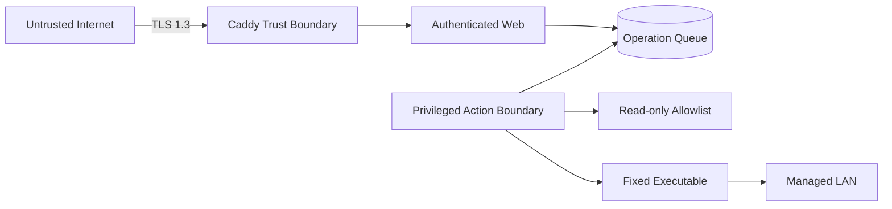

# セキュリティ設計

## 1. セキュリティ目標

1. Web 通信を [TLS](99_GLOSSARY.md#tls) 1.3 のみに限定する。
2. 認証済みかつ権限のある利用者だけが Wake 操作を実行できる。
3. Web 入力から任意コマンド、任意 MAC、任意ネットワーク宛先を実行できない。
4. 設定ファイル、秘密情報、実行スクリプトを Web 経由で変更できない。
5. 誰が、いつ、どの対象へ、どの結果となったかを追跡できる。
6. ConoHa 踏み台の侵害時に到達可能な宛先と操作を限定する。

## 2. 信頼境界



> - Caddy より外側の入力は信頼しない。
> - Django Web が受け付けた操作も、WoL Agent が実行直前に再検証する。
> - Shell Script は CSV の許可済み値だけを受け取る。

## 3. 脅威と対策

| 脅威 | 主な対策 |
|---|---|
| 通信盗聴、改変 | TLS 1.3 のみ、公開証明書、HSTS |
| 匿名または権限外の Wake | Django 認証、役割、セッション、必要に応じた mTLS |
| CSRF | POST のみ、CSRF token、Origin 検証、SameSite Cookie |
| Shell injection | `target_id` のみ受付、固定 argv、`create_subprocess_exec()`、Shell 側の再検証 |
| 任意 MAC への送信 | 読取専用 CSV、実行直前の再検証、カタログ版照合 |
| HTTP 再送、リプレイ | Idempotency-Key、クールダウン、0-RTT 無効 |
| CSV 改変 | root 所有、アプリから読取専用、版ハッシュ、監査 |
| 踏み台の横展開 | 専用アカウント、公開鍵のみ、PermitOpen、転送種別制限 |
| 秘密情報漏えい | Git と CSV に保存しない、systemd credentials、ログ秘匿 |
| 状態の誤認 | Packet 送信結果と PING / SSH 結果を別々に表示 |

## 4. TLS 1.3

### 4.1 Caddy を公開入口にする

Django Web は `/run/wol-web/gunicorn.sock` だけで待ち受け、TCP ポートを
インターネットへ公開しない。

初期 Caddyfile の設計例:

```caddyfile
{
    email admin@example.net
    servers {
        0rtt off
        protocols h1 h2
    }
}

wol.example.net {
    tls {
        protocols tls1.3
    }

    @health path /health/*
    respond @health 404

    reverse_proxy unix//run/wol-web/gunicorn.sock

    header {
        Strict-Transport-Security "max-age=300"
        Content-Security-Policy "default-src 'self'; object-src 'none'; frame-ancestors 'none'; base-uri 'self'; form-action 'self'"
        X-Content-Type-Options "nosniff"
        X-Frame-Options "DENY"
        Referrer-Policy "no-referrer"
        Permissions-Policy "camera=(), microphone=(), geolocation=()"
        Cache-Control "no-store"
    }

    log
}
```

`wol.example.net` とメールアドレスは実環境値に置き換える。

### 4.2 TLS 方針

- `protocols tls1.3` で TLS 1.3 のみに限定する。
- TLS 1.3 の暗号スイートは個別固定せず、Caddy と Go の安全な既定値を使う。
- HTTP/3 の 0-RTT は状態変更リクエストの再送リスクを避けるため無効にする。
- 初期段階は HTTP/1.1 と HTTP/2 に限定し、UDP 443 を公開しない。
- TCP 80 は HTTPS リダイレクトまたは
  [ACME](99_GLOSSARY.md#acme) 検証だけに使う。
- HSTS は最初に短い `max-age=300` で検証し、安定後に
  `max-age=31536000` へ延長する。
- 全サブドメインの HTTPS を保証できるまで `includeSubDomains` と `preload` を
  追加しない。
- 証明書秘密鍵と Caddy データディレクトリをバックアップ対象とする。
- TLS 秘密情報を出力するデバッグ設定を本番で有効にしない。
- `/health/*` は公開入口で 404 とし、宅内 Ubuntu WoL サーバー側の監視は
  Gunicorn の Unix ソケットへ直接接続する。

内部監視例:

```bash
test "$(
  curl --silent --show-error \
    --output /dev/null \
    --write-out '%{http_code}' \
    --unix-socket /run/wol-web/gunicorn.sock \
    -H 'Host: wol.example.net' \
    -H 'X-Forwarded-Proto: https' \
    http://localhost/health/ready
)" = 200
```

### 4.3 IPv6 と証明書

- 公開ドメインの AAAA レコードを宅内 Ubuntu WoL サーバーの到達可能な IPv6
  アドレスへ設定する。
- TCP 80 と 443 の IPv6 到達性を外部から確認する。
- A と AAAA が別サーバーを指す場合、[Let's Encrypt](https://letsencrypt.org/docs/ipv6-support/)
  は最初に IPv6 を優先するため、両入口で同じ検証応答を返すか DNS-01 を使う。
- Phase 5A では AAAA を宅内 Caddy へ向け、IPv4 は SSH ProxyJump に限定する。
- Phase 5B では A と AAAA を ConoHa Caddy へ向け、ConoHa で TLS 1.3 を終端し、
  宅内 Caddy origin までを WireGuard で暗号化する。Django は Unix ソケットを
  維持する。

### 4.4 検証

次を自動受入試験に含める。

```bash
caddy validate --config /etc/caddy/Caddyfile
curl -6 --fail --show-error https://wol.example.net/
openssl s_client \
  -connect '[2001:db8::10]:443' \
  -servername wol.example.net \
  -verify_hostname wol.example.net \
  -verify_return_error \
  -CApath /etc/ssl/certs \
  -tls1_3 < /dev/null
if openssl s_client \
  -connect '[2001:db8::10]:443' \
  -servername wol.example.net \
  -tls1_2 < /dev/null; then
    exit 1
fi
```

期待結果:

- TLS 1.3 のハンドシェイクが成功する。
- TLS 1.2 のハンドシェイクが失敗する。
- 証明書名、期限、チェーンの検証が成功する。
- HTTP から Wake API を直接利用できない。

## 5. 認証と権限

### 5.1 アプリ認証

Django の標準認証、セッション、権限を利用する。

| Django Group | Django 権限 |
|---|---|
| `viewer` | `wol.view_target` |
| `operator` | `wol.view_target`, `wol.wake_target` |
| `admin` | 上記、`wol.view_audit`, `wol.reload_catalog`, 利用者管理権限 |

- 匿名アクセスを禁止する。
- 各 API は `has_perm()` または `PermissionRequiredMixin` で権限を毎回確認する。
- 未認証 API はログイン画面への 302 ではなく JSON の 401 を返す。
- 初期管理者パスワードをリポジトリへ保存しない。
- `django[argon2]` を導入し、`Argon2PasswordHasher` を先頭に設定する。
- 管理者には多要素認証の追加を検討する。
- 小人数の固定端末運用では Caddy mTLS を外側の追加制御として利用できる。
- mTLS を採用しても、操作主体と権限を記録するためアプリ認証を維持する。

パスワード設定例:

```python
PASSWORD_HASHERS = [
    "django.contrib.auth.hashers.Argon2PasswordHasher",
    "django.contrib.auth.hashers.PBKDF2PasswordHasher",
]
```

ログインは利用者 ID と信頼済み接続元ごとに制限する。既定は 15 分内の失敗 5 回で
15 分停止し、`Retry-After` を返す。存在する利用者と存在しない利用者で画面文言を
変えず、失敗時刻、接続元、request ID、結果だけを監査し、入力パスワードを記録
しない。

### 5.2 セッション

Django の想定設定:

```python
SESSION_COOKIE_SECURE = True
SESSION_COOKIE_HTTPONLY = True
SESSION_COOKIE_SAMESITE = "Strict"
CSRF_COOKIE_SECURE = True
CSRF_COOKIE_SAMESITE = "Strict"
SECURE_PROXY_SSL_HEADER = ("HTTP_X_FORWARDED_PROTO", "https")
SECURE_SSL_REDIRECT = True
SECURE_HSTS_SECONDS = 300
SECURE_CONTENT_TYPE_NOSNIFF = True
X_FRAME_OPTIONS = "DENY"
ALLOWED_HOSTS = ["wol.example.net"]
CSRF_TRUSTED_ORIGINS = ["https://wol.example.net"]
```

- セッション Cookie と CSRF Cookie をログへ記録しない。
- ログイン後のセッション固定化を防ぐ。
- アイドル時間と最大継続時間を設定する。
- Wake 操作前に権限をサーバー側で毎回確認する。
- Caddy からの `X-Forwarded-Proto` を信頼する範囲を Unix ソケット接続に限定する。

### 5.3 CSRF とリプレイ防御

- Wake は `POST /api/v1/targets/{target_id}/wake` だけで実行する。
- GET、画像、リンク表示では状態を変更しない。
- Django CSRF token と `Origin` / `Host` 検証を必須にする。
- `Idempotency-Key` を利用者と対象に関連付ける。
- 同じ key の再送を除き、利用者ごとの新規 Wake 受付を 60 秒内に 10 操作へ
  制限する。
- 同一対象に 60 秒のクールダウンを設ける。
- 古い `catalog_revision` からの操作を拒否する。

## 6. コマンド実行防御

### 6.1 Web 入力

Wake リクエストは `target_id` だけを URL に持つ。次を HTTP から受け取らない。

- MAC アドレス
- ブロードキャストアドレス
- UDP ポート
- Shell Script パス
- CSV パス
- 任意オプション
- 任意コマンド

### 6.2 Python 実行

- 絶対パスと argv 配列を使う。
- `asyncio.create_subprocess_exec()` を使い、Shell 実行 API を使わない。
- タイムアウトを設定する。
- 最小の固定環境変数を渡す。
- 固定 Script の標準出力と標準エラーを小さく保ち、監査保存量に上限を設ける。
- 非 0 終了、タイムアウト、実行ファイル不在を別エラーにする。
- 実行直前に最新 CSV を再検証する。

### 6.3 Shell Script

実装時の必須条件:

```bash
#!/bin/bash
set -euo pipefail
```

- 引数個数を固定する。
- MAC、IPv4 ブロードキャスト、ポートを再検証する。
- 初期実装ではポート 9 以外を拒否する。
- `/usr/bin/wakeonlan` を絶対パスで呼ぶ。
- `eval`、動的 `source`、文字列コマンドを使わない。
- 一時ファイルを必要としない設計にする。
- root 所有とし、WoL Agent 用ユーザーから書込不可にする。

検証後の最終実行は次の固定形とする。

```bash
exec /usr/bin/wakeonlan \
  -i "$broadcast_addr" \
  -p "$wol_port" \
  "$mac_addr"
```

`wakeonlan` は通常の UDP 送信なので、初期設計では sudo を使わない。実環境で
権限不足が確認された場合も、Web プロセス全体へ root 権限を与えず、必要な OS
機能だけを再評価する。

Script process 開始後の timeout、signal、非 0 終了は、Packet 送信前と送信後を
証明できないため `OUTCOME_UNKNOWN` とする。process 開始前の検証または起動失敗だけを
`FAILED` とし、`OUTCOME_UNKNOWN` を自動再実行しない。

## 7. OS とファイル権限

想定するサービスアカウント:

| アカウント | 用途 |
|---|---|
| `wol-web` | Django Web |
| `wol-agent` | 操作実行と状態確認 |
| `wol-operator` | 制限済み SSH コマンド |

`wol-web` は `wol-readers` と `wol-state`、`wol-agent` も `wol-readers` と
`wol-state`、`wol-operator` は `wol-dispatch` だけを補助グループとする。

想定する所有権:

| 対象 | 所有者 | 権限方針 |
|---|---|---|
| `/etc/wol-web/targets.csv` | `root:wol-readers` | アプリから読取専用 |
| `/usr/local/libexec/wol-send.sh` | `root:wol-agent` | `0750`、Agent から実行のみ |
| `/usr/local/libexec/wol-dispatch` | `root:root` | `0755`、固定 IPC client |
| `/var/lib/wol-web/identity.sqlite3` | `wol-web:wol-web` | `0600`、Web だけが認証情報を管理 |
| `/var/lib/wol-operations/` | `wol-agent:wol-state` | `2770`、Web と Agent の操作 DB 用 |
| `/run/wol-web/gunicorn.sock` | `wol-web:caddy` | Caddy から接続のみ |
| `/run/wol-agent/dispatch.sock` | `wol-agent:wol-dispatch` | `0660`、Dispatcher から受付のみ |
| `/etc/wireguard/wg-wol.conf` | `root:root` | `0600`、各 node は自身の秘密鍵だけを保持 |
| Caddy 証明書領域 | `caddy:caddy` | 他サービスから読取不可 |

`wol-operator` は `wol-dispatch` グループにだけ追加し、`wol-state` と
`wol-readers` には追加しない。Dispatcher は Agent の Unix ソケットへ要求し、
CSV と SQLite を直接読み書きしない。Agent は Unix peer credential と固定 actor
を監査記録へ保存し、`target_id` を最新 CSV で再検証する。

`operations.sqlite3`、`operations.sqlite3-wal`、`operations.sqlite3-shm` は
`wol-state` グループと `umask 0007` を共有する。Django DB router で認証、権限、
セッションを `identity.sqlite3`、操作系モデルを `operations.sqlite3` へ固定し、
WoL Agent に認証 DB のパス権限を与えない。

systemd unit では次を基準に調整する。

- `NoNewPrivileges=true`
- `PrivateTmp=true`
- `ProtectSystem=strict`
- `ProtectHome=true`
- `ProtectKernelTunables=true`
- `ProtectKernelModules=true`
- `ProtectControlGroups=true`
- `RestrictSUIDSGID=true`
- 書込先を `ReadWritePaths=` で限定する

WoL Agent の PING と UDP 送信に必要な機能を検証してから、
`RestrictAddressFamilies=` と capability を最小化する。

## 8. ネットワーク制御

### 8.1 Phase 5A の宅内 Ubuntu WoL サーバー

- IPv6 TCP 443: インターネットから Caddy へ許可
- IPv6 TCP 80: ACME と HTTPS リダイレクトに必要な場合だけ許可
- IPv6 TCP 22: ConoHa 踏み台の送信元 IPv6 と宅内管理網だけ許可
- Django の Unix ソケット: OS 内だけ
- UDP 9 送信: 登録済み宅内ブロードキャストだけ
- TCP 22 送信と PING: 登録済み `PROBE_ADDR` だけ

初期段階は HTTP/1.1 と HTTP/2 だけを利用し、UDP 443 を許可しない。将来
HTTP/3 を追加する場合は UDP 443、0-RTT 無効、HTTP/3 接続試験を同時に追加する。
Caddy 自体の待受アドレスだけに依存せず、宅内ルーターと Ubuntu ファイアウォールで
IPv6 公開範囲を制御する。

### 8.2 Phase 5B の ConoHa と宅内 Ubuntu WoL サーバー

ConoHa:

- IPv4 / IPv6 TCP 443: 公開 Caddy へ許可
- IPv4 / IPv6 TCP 80: ACME または HTTPS リダイレクトに必要な場合だけ許可
- WireGuard UDP port: 宅内 peer との接続用に許可
- SSH TCP 22: 管理元を制限

宅内 Ubuntu WoL サーバー:

- 公開 IPv4 / IPv6 TCP 80、443: 許可しない
- WireGuard: 宅内側から peer を確立し、NAT 配下では keepalive を設定する
- WireGuard interface 上の TCP 8080: 宅内 Caddy origin として ConoHa peer
  だけ許可
- WireGuard interface 上の SSH TCP 22: ConoHa peer だけ許可
- Django: Unix ソケットだけ
- UDP 9 と PING / TCP 22: Phase 5A と同じく登録済み宅内宛先だけ

ConoHa Caddy は元の Host、`X-Forwarded-Proto: https`、接続元情報を送る。宅内
Caddy は ConoHa の WireGuard peer だけを trusted proxy とし、送信元を確認後に
Django へ `X-Forwarded-Proto: https` を設定する。他の peer や header を信頼
しない。Host、CSRF Origin、接続元監査、SSL redirect を Phase 5B の受入試験に
含める。

Phase 5B の Caddy 間契約は次を基準にする。アドレスは例示であり、選定した
WireGuard peer 値へ置き換える。公開 ConoHa Caddy の site block:

```caddyfile
wol.example.net {
    tls {
        protocols tls1.3
    }

    @health path /health/*
    respond @health 404

    reverse_proxy http://10.90.0.2:8080 {
        header_up X-Forwarded-Proto https
    }
}
```

宅内 Caddy origin:

```caddyfile
{
    servers {
        0rtt off
        protocols h1 h2
        trusted_proxies static 10.90.0.1/32
        trusted_proxies_strict
    }
}

http://wol.example.net:8080 {
    bind 10.90.0.2

    @health path /health/*
    respond @health 404

    reverse_proxy unix//run/wol-web/gunicorn.sock {
        header_up X-Forwarded-Proto https
    }
}
```

ConoHa Caddy にも 4.1 節と同じ HTTP protocol、0-RTT、header、log 方針を適用する。
宅内 origin の平文 HTTP は WireGuard interface 内に限定し、Ubuntu
ファイアウォールでも `10.90.0.1 -> 10.90.0.2:8080` だけを許可する。

ConoHa Caddy の Proxy 障害は、origin 接続前でも操作登録後の応答消失でも 502 に
なり得る。ブラウザーは 502 から受付有無を断定せず、同じ `Idempotency-Key` で
再送する。POST を対象とする明示的な load-balancer retry は設定しない。HTTP
transport 内部で再送が生じる場合も同じ key を保持し、Django の DB 一意制約を
重複防止の最終境界とする。

### 8.3 ConoHa 踏み台

- IPv4 TCP 22 の送信元を可能な範囲で管理端末のアドレスへ限定する。
- パスワード認証、keyboard-interactive、root ログインを無効にする。
- jump 専用アカウントは公開鍵認証だけにする。
- `AllowTcpForwarding local` を使う。
- `PermitOpen` を選択済みの宅内 SSH 到達先 TCP 22 だけにする。
- SSH agent、X11、PTY、Shell セッションを提供しない。
- 踏み台上に宅内接続用の利用者秘密鍵を保存しない。

概念設定:

```sshdconfig
Match User wol-jump
    PasswordAuthentication no
    KbdInteractiveAuthentication no
    PubkeyAuthentication yes
    AuthenticationMethods publickey
    AllowAgentForwarding no
    AllowTcpForwarding local
    AllowStreamLocalForwarding no
    PermitOpen [2001:db8::10]:22
    PermitTunnel no
    PermitUserRC no
    GatewayPorts no
    X11Forwarding no
    PermitTTY no
    MaxSessions 0
```

ProxyJump では最終接続先の秘密鍵をオペレーター端末側が保持し、踏み台は TCP
転送だけを行う。

上の `PermitOpen [2001:db8::10]:22` は Phase 5A の例である。Phase 5B では
`PermitOpen 10.90.0.2:22` のように宅内 WireGuard peer だけを許可し、選ばなかった
経路は設定に残さない。

### 8.4 宅内 Ubuntu WoL サーバーの SSH

Wake 専用公開鍵には強制コマンドを設定する。

```text
command="/usr/local/libexec/wol-dispatch operator-a",restrict ssh-ed25519 AAAA...
```

`wol-dispatch` は `SSH_ORIGINAL_COMMAND` をそのまま Shell として実行せず、
`wake TARGET_ID IDEMPOTENCY_KEY` または `status OPERATION_ID` の固定形式だけを
解析する。key は UUID として完全検証する。
強制コマンドの固定引数を監査用 actor として使い、Agent の
`/run/wol-agent/dispatch.sock` へ固定形式で要求する。Dispatcher
には CSV と SQLite の権限を与えない。Agent が Web API と同じ受付サービスへ操作を
登録するため、CSV 再検証、クールダウン、Agent 実行、状態更新を迂回して
`wakeonlan` を直接呼べない。

宅内 Ubuntu WoL サーバーの sshd にも専用制限を設定する。

```sshdconfig
Match User wol-operator
    PasswordAuthentication no
    KbdInteractiveAuthentication no
    PubkeyAuthentication yes
    AuthenticationMethods publickey
    DisableForwarding yes
    PermitTunnel no
    PermitUserRC no
    X11Forwarding no
    PermitTTY no
```

`wol-operator` の authorized keys は、利用者が変更できない root 所有ファイルに
置く。公開鍵ごとに固定 actor を持つ強制コマンドを設定する。actor は対応する
Django 利用者と同じ正規化済み主体 ID とし、Web / SSH 合算の利用者上限と監査に
使う。

Phase 5A の IPv4 フォールバックはこの CLI 操作に限定し、ブラウザーの SSH ポート
転送は対象外とする。Phase 5B を選んだ場合は ConoHa Caddy が IPv4 / IPv6 Web
入口となり、ProxyJump は引き続き管理 CLI 専用とする。

## 9. SSH リバーストンネルの扱い

初期設計では SSH リバーストンネルを採用しない。宅内 IPv6 着信が使えない
Phase 5B は WireGuard を使い、Web origin と ProxyJump の第 2 区間を同じ管理済み
peer network に配置する。

## 10. 秘密情報

次を Git、CSV、ログへ保存しない。

- Django `SECRET_KEY`
- 初期管理者パスワード
- OIDC client secret
- SSH 秘密鍵
- WireGuard 秘密鍵と任意の preshared key
- mTLS CA 秘密鍵
- DNS-01 API token

systemd の `LoadCredentialEncrypted=` を第一候補とし、サービス開始時だけ必要な
資格情報を渡す。WireGuard は root 所有 `0600` の node 別設定を使い、ConoHa と
宅内 Ubuntu WoL サーバーはそれぞれ自身の秘密鍵だけを保持して、相手には公開鍵だけを
渡す。秘密鍵を表示する診断出力をログへ残さない。鍵更新と暗号化バックアップからの
復元を運用試験に含める。開発環境の `.env` は Git 対象外にし、本番の正本にしない。

## 11. 監査ログ

### 11.1 Wake 操作ログ

最低限、次を構造化して記録する。

- UTC timestamp
- `request_id`
- `operation_id`
- 認証済み利用者 ID
- 信頼できる範囲で得た接続元アドレス
- `target_id`
- 正規化済み MAC
- `catalog_revision`
- 操作状態
- Shell Script 終了コード
- 所要時間
- 拒否または失敗理由

### 11.2 記録しない情報

- パスワード
- セッション Cookie
- CSRF token
- Authorization header
- SSH 秘密鍵
- WireGuard 秘密鍵と preshared key
- DNS API token
- Django `SECRET_KEY`

Caddy のアクセスログと Django / WoL Agent の操作ログを分離する。journald を
永続化し、保持期間と容量上限を決める。

## 12. セキュリティ受入条件

- TLS 1.3 は成功し、TLS 1.2 以下は失敗する。
- 証明書名、期限、チェーンを検証できる。
- 未認証、viewer、CSRF 不正では Wake を実行しない。
- ログイン失敗上限を超えた要求を一時停止し、失敗を秘密情報なしで監査する。
- 任意 MAC、Shell メタ文字、余分な引数を実行できない。
- CSV 変更後の古い Wake 操作を実行しない。
- 同じ Idempotency-Key は同じ操作を返し、新しい操作を登録しない。
- 同じ Idempotency-Key の並行要求でも DB 一意制約により一つの操作だけを登録する。
- 利用者上限を超えた新規 Wake は、Web では 429 と `Retry-After`、SSH では
  `RATE_LIMITED` と `retry_after_seconds` を返し、Shell を実行しない。
- 実行中停止は `OUTCOME_UNKNOWN` とし、自動再実行しない。
- Script process 開始後の timeout、signal、非 0 終了を未送信と断定しない。
- `wakeonlan` 成功だけで `POWER_STATUS=ON` にしない。
- 踏み台アカウントから許可以外の宛先へ転送できない。
- 公開 Caddy から `/health/*` を取得できない。
- WoL Agent から Django 認証 DB を読み書きできない。
- SSH agent forwarding を利用しない。
- Git 履歴、設定 CSV、ログに秘密情報がない。

## 13. 参考資料

- [TLS 1.3: RFC 8446](https://www.rfc-editor.org/rfc/rfc8446.html)
- [Caddy TLS directive](https://caddyserver.com/docs/caddyfile/directives/tls)
- [Caddy global options](https://caddyserver.com/docs/caddyfile/options)
- [Caddyfile site address](https://caddyserver.com/docs/caddyfile/concepts#addresses)
- [Caddy bind](https://caddyserver.com/docs/caddyfile/directives/bind)
- [Caddy reverse proxy](https://caddyserver.com/docs/caddyfile/directives/reverse_proxy)
- [WireGuard Quick Start](https://www.wireguard.com/quickstart/)
- [Django security](https://docs.djangoproject.com/en/5.2/topics/security/)
- [Django authentication](https://docs.djangoproject.com/en/5.2/topics/auth/default/)
- [Django CSRF](https://docs.djangoproject.com/en/5.2/ref/csrf/)
- [Python subprocess security](https://docs.python.org/3/library/subprocess.html#security-considerations)
- [OpenSSH ProxyJump](https://man.openbsd.org/ssh_config#ProxyJump)
- [OpenSSH forwarding restrictions](https://man.openbsd.org/sshd_config#AllowTcpForwarding)
- [systemd credentials](https://systemd.io/CREDENTIALS/)
- [Ubuntu wakeonlan manual](https://manpages.ubuntu.com/manpages/jammy/man1/wakeonlan.1.html)
