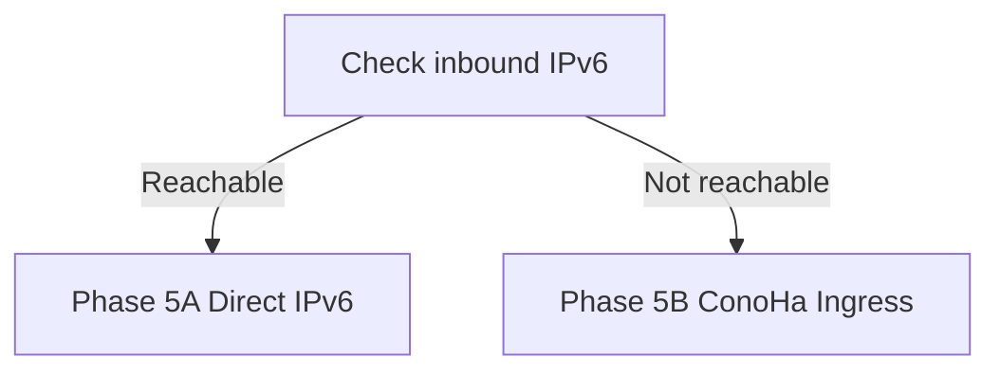

# 開発計画

## 1. 現在地

- リポジトリ: `Matthew-rule404/wol_6_4`
- 既定ブランチ: `main`
- 現在の段階: 設計
- 実装済み機能: なし

初期方針は、実機を起動する前に CSV 読込、許可制御、偽の WoL 実行器、Web 表示を
順に接続し、最後に Magic Packet を送ることである。

## 2. 正本文書

設計と実装の判断は次の優先順位で管理する。

1. [アーキテクチャ](01_ARCHITECTURE.md)
2. [API とデータ設計](02_API_AND_DATA.md)
3. [セキュリティ設計](03_SECURITY.md)
4. 本開発計画
5. README

公開 [API](99_GLOSSARY.md#api) を変更する場合は `02_API_AND_DATA.md`、
配置または通信経路を変更する場合は `01_ARCHITECTURE.md` と
`03_SECURITY.md` を同じ変更単位で更新する。

## 3. 実装原則

- 変更単位を小さく保つ。
- 先に偽実装で境界を確認する。
- HTTP から MAC や Shell コマンドを受け取らない。
- 許可リストを実行直前にも検証する。
- Packet 送信成功と対象 PC 起動成功を分離する。
- Python 3.10 以上、全関数の型ヒント、`from __future__ import annotations` を
  基準とする。
- Shell Script は `#!/bin/bash` と `set -euo pipefail` を必須にする。
- エラーには `request_id`、`operation_id`、`target_id`、理由を含める。
- 秘密情報を Git、CSV、ログに保存しない。

## 4. 想定ディレクトリ

```text
wol_6_4/
|-- config/
|   `-- targets.csv.example
|-- clients/
|   `-- wolctl
|-- deploy/
|   |-- caddy/
|   |   `-- Caddyfile.example
|   |-- ssh/
|   |   `-- README.md
|   `-- systemd/
|       |-- wol-agent.service
|       `-- wol-web.service
|-- docs/
|-- scripts/
|   `-- wol-send.sh
|-- src/
|   `-- wol_web/
|       |-- catalog/
|       |-- operations/
|       |-- probes/
|       |-- web/
|       `-- manage.py
|-- tests/
|   |-- fixtures/
|   |-- integration/
|   `-- unit/
|-- pyproject.toml
`-- README.md
```

> - `config/` はサンプルだけを Git 管理し、本番 CSV は `/etc/wol-web/` に置く。
> - `clients/wolctl` はオペレーター端末側で UUID と ProxyJump 再送を管理する。
> - `deploy/` は Caddy、OpenSSH、systemd の配置例を保持する。
> - `scripts/` は固定 WoL 実行境界を保持する。

## 5. フェーズ

### Phase 0: 設計確定

状態: 完了

作業:

- [x] Magic Packet のネットワーク制約を整理する。
- [x] IPv6 HTTPS と IPv4 ProxyJump を別経路として定義する。
- [x] TLS 1.3 の終端を Caddy とする。
- [x] 指定 7 列 CSV の互換仕様を定義する。
- [x] CSV と変動状態を分離する。
- [x] Wake API が `target_id` だけを受け取る仕様を定義する。
- [x] Packet 送信と状態確認を別イベントにする。
- [x] 未確定の実環境値と必要フェーズを一覧化する。

完了条件:

- 未確定値が実環境パラメーターとして一覧化されている。
- 脅威、通信経路、API、データ所有者に矛盾がない。
- Phase 1～3A を文書用設定と偽実装で開始できる。

公開ドメイン、実 IPv6、対象アドレス、mTLS などは設計 Phase 全体のゲートにせず、
必要になる各配置フェーズの開始条件とする。

### Phase 1: 最小 CLI と CSV

状態: 未着手

作業:

- [ ] `pyproject.toml` と型検査、pytest、lint を設定する。
- [ ] `WakeTarget`、`MacAddress`、`CatalogSnapshot` を実装する。
- [ ] 指定 7 列と拡張列を扱う CSV パーサーを実装する。
- [ ] スマートクォート、重複、不正 MAC、不正時刻を拒否する。
- [ ] 偽の `WakeExecutor` を実装する。
- [ ] `scripts/wol-send.sh` を実装する。
- [ ] 隔離コンテナまたは一時 root filesystem の `/usr/bin/wakeonlan` に偽実装を
  置き、固定パスの引数を検証する。
- [ ] 実行直前の許可リスト再検証を実装する。

完了条件:

- 正常 CSV を不変スナップショットとして読み込める。
- 不正 CSV のファイル名、行番号、列名、理由が表示される。
- 未登録または無効な対象では Shell Script が一度も実行されない。
- `MS-02ULTRA` が正規化済み MAC へ安全に対応付けられる。
- 同じ target_id の MAC または PROBE_ADDR 変更を `target_revision` で検出できる。
- 実 Magic Packet を送らずに全単体テストが成功する。

### Phase 2: 状態保存と読取専用 Web

状態: 未着手

作業:

- [ ] Django プロジェクト、認証 DB、共有操作 DB の schema と router を作成する。
- [ ] `ProbeObservation` と `TargetStatus` を保存する。
- [ ] 正常 `CatalogSnapshot` を操作 DB に保存し、再起動後も閲覧できるようにする。
- [ ] PING と TCP 22 の偽プローブを作成する。
- [ ] CSV と状態を結合した一覧画面を作成する。
- [ ] `/api/v1/targets` と詳細 API を作成する。
- [ ] 状態の鮮度と CSV 読込警告を表示する。
- [ ] `target_revision` が変わった対象の旧観測を除外し、`UNKNOWN` として表示する。
- [ ] Django Group と `wol.view_target` 権限を使う viewer 認証を追加する。
- [ ] Argon2id とログイン試行制限を追加する。
- [ ] 未認証 API が JSON の 401 を返すようにする。

完了条件:

- CSV の全対象が Web 画面に表示される。
- PING、SSH、最終確認時刻、`UNKNOWN`、stale を区別できる。
- CSV が不正になっても直前の正常一覧を表示できる。
- CSV が不正な状態で再起動しても stale 一覧を表示し、Wake readiness は false にする。
- 同じ target_id の MAC または PROBE_ADDR 変更後は、新しい実測まで旧状態を表示しない。
- ログイン失敗上限と JSON 401 を確認できる。
- この段階では Web から Wake を実行できない。

### Phase 3: Wake 操作

状態: 未着手

#### Phase 3A: 偽 Executor での一連動作

作業:

- [ ] `WakeOperation` と操作状態を実装する。
- [ ] `AgentHeartbeat`、受付期限、原子的 claim を実装する。
- [ ] operator / admin の Django Group と権限を実装する。
- [ ] CSRF、Origin、Host 検証を有効にする。
- [ ] `POST /api/v1/targets/{target_id}/wake` を実装する。
- [ ] `GET /api/v1/wake-operations/{operation_id}` を実装する。
- [ ] Idempotency-Key の DB 一意制約、既存 key 優先検索、X-Catalog-Revision、
  クールダウンを実装する。
- [ ] 利用者ごとの新規 Wake 受付上限と `Retry-After` を実装する。
- [ ] WoL Agent が待機操作を取得する処理を実装する。
- [ ] Agent が CSV とカタログ版を再検証する。
- [ ] 偽 Executor で `ACCEPTED` から完了状態まで接続する。
- [ ] 監査ログを実装する。

Phase 3A 完了条件:

- `POST -> operations.sqlite3 -> Agent -> fake Executor -> GET operation` が成立する。
- API は `target_id` 以外の送信先情報を受け取らない。
- 未認証、viewer、CSRF 不正、古いカタログ版では操作を登録しない。
- 同じ Idempotency-Key の並行要求は一つの操作だけを作り、同じ操作を返す。
- 初回受付後に CSV 版やクールダウン状態が変わっても、同じ key は元の操作を返す。
- 60 秒内に別々の許可対象へ行う 11 件目の新規操作は 429 となり、同じ key の
  再送は上限に数えない。
- 別々の許可対象を使う 10 件境界の異なる key の並行要求は一方だけを受け付け、
  他方は 500 ではなく 429 になる。
- stale Agent では 503、取得期限超過では `EXPIRED` になる。

#### Phase 3B: 固定 Script と Packet

作業:

- [ ] 固定 Shell Script を `create_subprocess_exec()` で呼ぶ。
- [ ] 対象 Ubuntu release と同じ隔離環境へ `wakeonlan` package を導入し、
  `/usr/bin/wakeonlan` の存在と固定 argv での実行を確認する。
- [ ] UDP 受信テストで Magic Packet の内容を検証する。
- [ ] timeout、signal、非 0 終了、Agent 停止時の `OUTCOME_UNKNOWN` 回復規則を
  実装する。

Phase 3B 完了条件:

- 正常時は `202 Accepted` と `operation_id` を返す。
- 同じ Idempotency-Key から新しい操作を作らない。
- Shell Script 成功後も対象状態を自動で `ON` にしない。
- Agent が実行中に停止した操作を自動再実行しない。
- Script process 開始後の timeout、signal、非 0 終了を `FAILED` と断定しない。

### Phase 4: 状態監視

状態: 未着手

作業:

- [ ] 宅内 Ubuntu WoL サーバー側から PING を実行する。
- [ ] 宅内 Ubuntu WoL サーバー側から TCP 22 を確認する。
- [ ] 通常監視間隔とジッターを実装する。
- [ ] Wake 後の段階的な追加監視を実装する。
- [ ] Agent 再起動時に Wake 後確認を再開し、確認期間超過を `INTERRUPTED` にする。
- [ ] Wake 後確認中の `target_revision` 変更を `TARGET_CHANGED` で中断する。
- [ ] SQLite へ周期単位で状態を保存する。
- [ ] UI の HTTP ポーリングを実装する。

完了条件:

- PING と SSH の結果を独立して追跡できる。
- どちらかが `OK` なら `ON` と推定できる。
- 両方が失敗した場合は誤って `OFF` と断定しない。
- 状態が古い場合に `stale` を表示できる。
- Packet 送信から応答確認までを `operation_id` で追跡できる。
- Agent 再起動後も確認状態が永続的な `NOT_STARTED` / `PROBING` のまま残らない。
- 対象設定変更後の新しい監視先結果を、変更前の Wake 操作へ関連付けない。

### Phase 5: 公開経路の決定

状態: 未着手

作業:

- [ ] Phase 3B で選定した Ubuntu release と、本番の CPU architecture、NIC を
  配置値として再確認する。
- [ ] 宅内 Ubuntu WoL サーバーのグローバル IPv6 と着信 TCP 443 を確認する。
- [ ] IPv6 prefix の固定または変動と AAAA 更新方法を確認する。
- [ ] ConoHa から宅内 IPv6 TCP 22 への到達性を確認する。
- [ ] 公開ドメイン、証明書検証方式、利用者数、mTLS 要否を確定する。
- [ ] 次の分岐から 1 つを選び、設計判断を更新する。



完了条件:

- 宅内 IPv6 直接公開または ConoHa HTTPS 入口のどちらかを選択している。
- 選択した経路の TLS 終端、宅内への暗号化区間、DNS、ファイアウォールが
  文書化されている。
- Phase 6 の ProxyJump が使う第 2 区間の到達先が決まっている。

### Phase 5A: 宅内 IPv6 TLS 配置

宅内 Ubuntu WoL サーバーが着信 IPv6 を受けられる場合に実施する。

作業:

- [ ] 宅内 Caddyfile を作成する。
- [ ] Django を Unix ソケットで待ち受ける。
- [ ] Caddy、Django、WoL Agent の systemd unit を作成する。
- [ ] Ubuntu `wakeonlan` package を導入し、`/usr/bin/wakeonlan` の存在と
  実行可能性を確認する。
- [ ] `wol-send.sh` と操作 DB の所有者、group、umask を配置する。
- [ ] 資格情報を systemd credentials で渡す。
- [ ] IPv6 AAAA と宅内ファイアウォールを設定する。
- [ ] 公開証明書の自動取得と更新を確認する。
- [ ] TLS 1.3 成功、TLS 1.2 失敗を確認する。
- [ ] `/health/*` 非公開、セキュリティヘッダー、HTTP/3 無効を確認する。
- [ ] 全サービスの再起動後の自動復旧を確認する。

完了条件:

- IPv6 ブラウザーから正しい証明書で接続できる。
- TLS 1.3 以外で接続できない。
- Django の TCP 待受がインターネットから見えない。
- 未認証利用者は一覧と Wake API を利用できない。
- Agent が認証 DB へアクセスできない。
- 証明書更新のテストが成功する。

### Phase 5B: ConoHa HTTPS 入口

宅内 Ubuntu WoL サーバーが着信 IPv6 を受けられない場合に実施する。

作業:

- [ ] 宅内 Caddy、Django、WoL Agent の systemd unit を作成する。
- [ ] Ubuntu `wakeonlan` package を導入し、`/usr/bin/wakeonlan` の存在と
  実行可能性を確認する。
- [ ] `wol-send.sh` と操作 DB の所有者、group、umask を配置する。
- [ ] 資格情報を systemd credentials で渡す。
- [ ] ConoHa に dual-stack Caddy を配置し、A と AAAA を設定する。
- [ ] ブラウザーから ConoHa までを TLS 1.3 のみにする。
- [ ] ConoHa と宅内 Ubuntu WoL サーバー間に WireGuard を構成する。
- [ ] WireGuard 秘密鍵を各 node の root 所有 `0600` ファイルへ分離し、公開鍵だけを
  相互登録する。
- [ ] WireGuard 鍵更新と暗号化バックアップからの復元を試験する。
- [ ] 宅内 Caddy の origin を固定 TCP 8080 で待ち受け、WireGuard 上の ConoHa
  peer だけに許可する。Django は Unix ソケットを維持する。
- [ ] ConoHa Caddy から WireGuard 経由で宅内 Caddy へ中継する。
- [ ] ConoHa を信頼済み proxy とするヘッダー範囲を明示する。
- [ ] Host、`X-Forwarded-Proto=https`、接続元情報を ConoHa peer からだけ継承する。
- [ ] origin 接続前と操作登録後の応答消失をそれぞれ再現し、どちらの 502 も
  受付結果確認中として同じ Idempotency-Key で操作 ID を回収する。
- [ ] ConoHa に CSV、Django 認証 DB、宅内用秘密鍵を配置しない。
- [ ] `/health/*` 非公開、セキュリティヘッダー、HTTP/3 無効を両 Caddy で確認する。
- [ ] 全サービスと WireGuard の再起動後の自動復旧を確認する。

完了条件:

- IPv4 と IPv6 のブラウザーから ConoHa へ TLS 1.3 で接続できる。
- ConoHa から宅内 origin まで WireGuard で暗号化される。
- 宅内 origin は WireGuard peer 以外から到達できない。
- ConoHa と宅内 Ubuntu WoL サーバーが相手側の WireGuard 秘密鍵を保持しない。
- TCP 8080 は Web リクエストや CSV から変更できず、公開 interface から到達できない。
- Django の SSL redirect、CSRF Origin、接続元監査が proxy 経路でも正常に動く。
- Proxy の 502 から受付有無を断定せず、同じ key の再送で操作を一つだけ成立させる。
- Agent が認証 DB へアクセスできない。
- 証明書更新のテストが成功する。

### Phase 6: ConoHa ProxyJump

状態: 未着手

作業:

- [ ] ConoHa の IPv4 と IPv6 を確認する。
- [ ] jump 専用 SSH アカウントと鍵を作成する。
- [ ] パスワード、PTY、X11、agent forwarding を無効にする。
- [ ] `PermitOpen` を選択済みの宅内 SSH 到達先 TCP 22 に限定する。
- [ ] 宅内側に強制コマンド用アカウントを作成する。
- [ ] SSH 公開鍵の固定 actor を対応する Django 利用者の主体 ID と一致させる。
- [ ] Agent の受付 Unix socket と `wol-dispatch` を配置する。
- [ ] UUID key を保持して同じ Wake 要求を再送できる `wolctl` を作成する。
- [ ] オペレーター端末側の `~/.ssh/config` 例を検証する。
- [ ] 踏み台経由で許可済み `target_id` だけを実行できることを確認する。
- [ ] 踏み台経由で本人の `operation_id` だけを確認できることを確認する。
- [ ] Wake の SSH 応答消失後も同じ key から同じ `operation_id` を回収できることを
  確認する。
- [ ] SSH で別々の許可対象へ行う新しい key の 11 件目は `RATE_LIMITED` と
  `retry_after_seconds` を返し、既存 key の再送は同じ `operation_id` を返すことを
  確認する。
- [ ] 同じ主体 ID の Web と SSH の新規操作を合算し、合計 11 件目を拒否する。
- [ ] Web で登録した主体、対象、key を SSH から再送し、同じ `operation_id` を
  回収できることを確認する。
- [ ] 許可以外の宛先、ポート、コマンドを拒否することを確認する。
- [ ] `sshd -t` と条件付き実効設定を検証する。

完了条件:

- IPv4 専用のオペレーター端末から ConoHa へ接続できる。
- ConoHa から宅内 Ubuntu WoL サーバーへ選択済み経路で到達できる。
- 最終接続先の秘密鍵は ConoHa に保存されない。
- 任意 Shell、任意 MAC、任意 TCP 転送を利用できない。
- SSH 応答消失後の再送で Wake 操作を重複作成しない。
- SSH 入口から利用者上限を迂回できない。

### Phase 7: 耐障害性と運用

状態: 未着手

作業:

- [ ] CSV 読込中断、破損、外部更新を試験する。
- [ ] SQLite busy、再起動、ディスク不足を試験する。
- [ ] Caddy、Web、Agent、SSH 経路の障害を個別に試験する。
- [ ] Proxy が POST 応答を失う場合と Wake 後確認中の Agent 再起動を試験する。
- [ ] journald の永続化、保持期間、容量上限を設定する。
- [ ] バックアップと復元を試験する。
- [ ] 必要な場合だけ 7 列形式の状態 CSV 出力を実装する。
- [ ] BIOS、NIC、待機電力、VLAN を含む実機確認手順を作成する。
- [ ] 依存関係更新と脆弱性確認の手順を作成する。

完了条件:

- 障害時に受付結果不明、送信済み、応答なし、確認中断を誤認なく表示できる。
- 再起動後もカタログ、状態、操作履歴を復元できる。
- 秘密情報を含めずに原因を追跡できる。
- 実機 Wake を複数回再現できる。

## 6. 初期テスト一覧

| 種別 | コマンドまたは方法 | 期待結果 |
|---|---|---|
| Python 単体 | `pytest` | CSV、許可制御、状態規則が成功 |
| 型検査 | `mypy src tests` | 型エラーなし |
| Shell 構文 | `bash -n scripts/wol-send.sh` | 構文エラーなし |
| Shell 静的検査 | `shellcheck scripts/wol-send.sh` | 重大警告なし |
| Shell 統合 | 隔離環境の偽 `/usr/bin/wakeonlan` | 本番パスを変更せず argv を確認 |
| Django | `python manage.py check --deploy` | 本番設定の重大警告なし |
| Caddy | `caddy validate --config ...` | 設定正常 |
| TLS | `openssl s_client` | 1.3 成功、1.2 失敗 |
| IPv6 | 外部ネットワークから `curl -6` | 証明書検証付きで成功 |
| Magic Packet | UDP テスト受信器 | MAC の 16 回反復を確認 |
| OpenSSH server | `sshd -t` と実効設定確認 | jump / operator 制限が有効 |
| ProxyJump | `ssh -vv wol-home` | IPv4 から踏み台、選択経路から宅内へ接続 |

## 7. 実装着手前の確認事項

次の値がない状態でも Phase 1～3A の偽実装までは進められる。実機送信と公開配置の
前に確定する。

| 項目 | 必要フェーズ |
|---|---:|
| 公開ドメイン | Phase 5 |
| 宅内 Ubuntu release / wakeonlan package 版 | Phase 3B |
| 宅内 CPU architecture、Python、Caddy の対象版 | Phase 5 |
| 宅内 Ubuntu WoL サーバーの IPv6 着信可否 | Phase 5 |
| 宅内 Ubuntu WoL サーバーの NIC / 送信インターフェース | Phase 3B、4 |
| WireGuard peer address | Phase 5B |
| 対象 PC の `PROBE_ADDR` | Phase 4 |
| 対象サブネットの `BROADCAST_ADDR` | Phase 3B |
| ConoHa の IPv4 / IPv6 | Phase 5、6 |
| 認証利用者と役割 | Phase 2～3 |
| mTLS の要否 | Phase 5 |
| 初期既定値の実環境調整 | Phase 4、7 |

## 8. 今回の設計完了条件

- [x] 要求をコンポーネントへ対応付けた。
- [x] IPv6 Web と IPv4 ProxyJump の成立条件を記載した。
- [x] CSV の不正例と推奨形式を記載した。
- [x] API、操作状態、状態確認規則を記載した。
- [x] TLS 1.3、認証、CSRF、Shell 実行防御を記載した。
- [x] 段階的な実装順と受入条件を記載した。
- [ ] 実環境パラメーターを利用者と確認する。

設計文書の作成完了は、アプリの実装完了を意味しない。次の作業単位は
Phase 1 の最小 CLI と CSV パーサーである。
